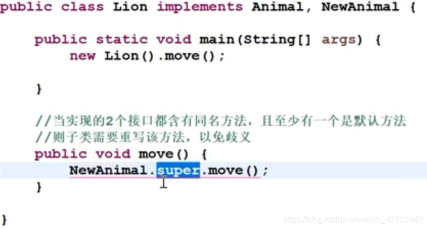
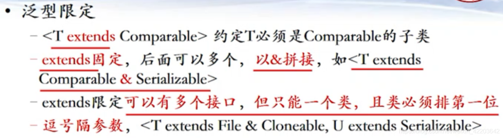
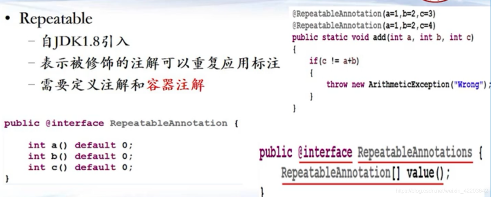
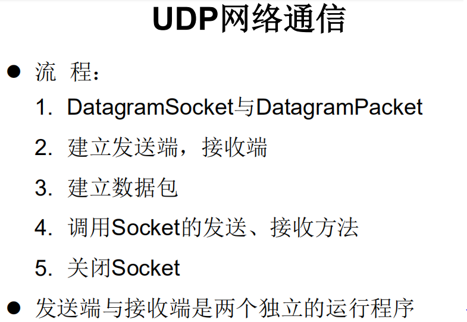

* 一个java文件只能有一个public class，public class的名字必须和文件名字一样；


* 每个子类的构造函数的第一句话，都默认调用父类的无参构造函数super()，super语句必须放在第一条；

##### 嵌套类


```java
		//创建Dog实例(静态的成员内部类):
		Person.Dog dog = new Person.Dog();
		dog.show();
		//创建Bird实例(非静态的成员内部类):
		//Person.Bird bird = new Person.Bird();错误的
		Person p = new Person();
		Person.Bird bird = p.new Bird();
		bird.sing();
	/*
	 * 在局部内部类的方法中（比如：show）如果调用局部内部类所声明的方法(比如：method)中的局部变量(比如：num)的话,
	 * 要求此局部变量声明为final的。
	 * 
	 * jdk 7及之前版本：要求此局部变量显式的声明为final的
	 * jdk 8及之后的版本：可以省略final的声明
	 * 
	 */
	public void method(){
		//局部变量
		int num = 10;
		
		class AA{
			
			public void show(){
//				num = 20;
				System.out.println(num);
				
			}
			
		}
		
	}
	
}
```


* 派生类继承抽象类，若没有实现基类中的所有abstract方法，那么派生类也必须被定义为抽象类；实现接口，就必须实现所有未实现的方法，如果没有全部实现，那么只能成为一个抽象类；接口没有构造函数和main函数，抽象类可以有main函数且能运行；





1. JDK7及以前：只能定义全局常量和抽象方法全局常量：public static final的，但是书写时，可以省略不写抽象方法：public abstract的
2. JDK8：除了定义全局常量和抽象方法之外，还可以定义静态方法、默认方法


* 静态方法需要调用才会执行，执行顺序：static块>匿名块>构造函数；


* 常量池：相同的值只存取一份，节省内存，共享访问；


> 1. 常量与常量的拼接结果在常量池。且常量池中不会存在相同内容的常量
>
> 2. 只要其中有一个是变量，结果就在堆中，如果变量是final类型的final就是常量，结果拼加后在常量池
>
> 3. 如果拼接的结果调用intern()方法，返回值就在常量池中，str1=str2.intern()
>
> 4. String:代表不可变的字符序列。简称：不可变性。


* 不可变对象一旦创建，这个对象(状态/值)不能被更改了，如八个基本型别的包装类的对象，String,BigInteger和BigDecimal等的对象；

> 1. 当对字符串重新赋值时，需要重写指定内存区域赋值，不能使用原有的value进行赋值。
>
> 2. 当对现有的字符串进行连接操作时，也需要重新指定内存区域赋值，不能使用原有的value进行赋值。
>
> 3. 当调用String的replace()方法修改指定字符或字符串时，也需要重新指定内存区域赋值，不能使用原有的value进行赋值。


##### 访问规则 #####


##### 异常规则 #####


* 使用try-catch-finally处理编译时异常，是得程序在编译时就不再报错，但是运行时仍可能报错，相当于我们使用try-catch-finally将一个编译时可能出现的异常，延迟到运行时出现；也即是说try必须有，catch和finally至少要有一个，finally必执行，catch块的异常匹配是从上而下执行的，并且只能进入一个catch块；finally中声明的是一定会被执行的代码，即使catch中又出现异常了；针对于编译时异常，我们说一定要考虑异常的处理。

> 异常打印写法：
>
> e.printStackTrace();
>
> System.out.println(e.getMessage());


* 在方法内部程序中，用throw抛出异常；在方法头部声明中，用throws。

````java
public class ReturnExceptionDemo {
	static void methodA() {
		try {
			System.out.println("进入方法A");
			throw new RuntimeException("制造异常");
		} finally {
			System.out.println("用A方法的finally");
		}
	}

	static void methodB() {
		try {
			System.out.println("进入方法B");
			return;
		} finally {
			System.out.println("调用B方法的finally");
		}
	}

	public static void main(String[] args) {
		try {
			methodA();
		} catch (Exception e) {
			System.out.println(e.getMessage());
		}
		
		methodB();
	}
}
输出：
进入方法A
用A方法的finally
制造异常
进入方法B
调用B方法的finally
````

* 可以抛出的异常必须是 Throwable 或其子类的实例，此语句在编译时将会产生语法错误：throw new String("want to throw")


> 如何自定义异常类？
>
> 1. 继承于现有的异常结构：RuntimeException 、Exception
> 2. 提供全局常量：serialVersionUID
> 3. 提供重载的构造器

```java
public class MyException extends Exception{
	
	static final long serialVersionUID = -7034897193246939L;
	
	public MyException(){
		
	}
	
	public MyException(String msg){
		super(msg);
	}
}
```


##### 数据结构

* Collection接口：单列集合，用来存储一个一个的对象
  * List接口：存储有序的、可重复的数据。 -->“动态”数组
    * ArrayList：作为List接口的主要实现类；线程不安全的，效率高；底层使用Object[] elementData存储
    * LinkedList：对于频繁的插入、删除操作，使用此类效率比ArrayList高；底层使用双向链表存储
    * Vector：作为List接口的古老实现类；线程安全的，效率低；底层使用Object[] elementData存储
  * Set接口：存储无序的、不可重复的数据  -->高中讲的“集合”
    * HashSet：作为Set接口的主要实现类；线程不安全的；可以存储null值
    * LinkedHashSet：作为HashSet的子类；遍历其内部数据时，可以按照添加的顺序遍历，对于频繁的遍历操作，LinkedHashSet效率高于HashSet.
    * TreeSet：可以按照添加对象的指定属性，进行排序。

* Map接口：双列集合，用来存储一对(key - value)一对的数据
  * HashMap:作为Map的主要实现类；线程不安全的，效率高；存储null的key和value
    * LinkedHashMap:保证在遍历map元素时，可以按照添加的顺序实现遍历。原因：在原有的HashMap底层结构基础上，添加了一对指针，指向前一个和后一个元素。对于频繁的遍历操作，此类执行效率高于HashMap。
  * TreeMap:保证按照添加的key-value对进行排序，实现排序遍历。此时考虑key的自然排序或定制排序。底层使用红黑树
  * Hashtable:作为古老的实现类；线程安全的，效率低；不能存储null的key和value
  * Properties:常用来处理配置文件。key和value都是String类型


###### Collection

* 向Collection接口的实现类的对象中添加数据obj时，要求obj所在类要重写equals()

+ 迭代器Iterator：在调用it.next()方法之前必须要调用it.hasNext()进行检测。若不调用，且下一条记录无效，直接调用it.next()会抛出NoSuchElementException异常

* Iterator可以删除集合的元素，但是是遍历过程中通过迭代器对象的remove方法，不是集合对象的remove方法。 

* 如果还未调用next()或在上一次调用 next 方法之后已经调用了remove方法，再调用remove都会报IllegalStateException

* 使用 foreach 循环遍历集合元素，遍历集合的底层调用Iterator完成操作。


###### List

* 建议开发中使用带参的构造器：ArrayList list = new ArrayList(int capacity)

* jdk7中的ArrayList的对象的创建类似于单例的饿汉式，开始就创建了数组的长度，而jdk8中的ArrayList的对象的创建类似于单例的懒汉式，延迟了数组的创建，节省内存。


###### Set

* 向Set(主要指：HashSet、LinkedHashSet)中添加的数据，其所在的类一定要重写hashCode()和equals()；重写的hashCode()和equals()尽可能保持一致性：相等的对象必须具有相等的散列码

* 重写两个方法的小技巧：对象中用作 equals() 方法比较的 Field，都应该用来计算 hashCode 值。

* 向TreeSet中添加的数据，要求是相同类的对象，不可以容纳null元素


###### Map

* HashMap的底层：数组+链表 （jdk7及之前），数组+链表+红黑树 （jdk 8）

* Map中的key:无序的、不可重复的，使用Set存储所有的key ---> key所在的类要重写equals()和hashCode() （以HashMap为例）；Map中的value:无序的、可重复的，使用Collection存储所有的value --->value所在的类要重写equals()

* 存储过程，调用key1所在类的hashCode()计算key1哈希值，此哈希值经过某种算法计算以后，得到在Entry数组中的存放位置。
  *  如果此位置上的数据为空，此时的key1-value1添加成功
  * 如果此位置上的数据不为空，(意味着此位置上存在一个或多个数据(以链表形式存在)),比较key1和已经存在的一个或多个数据的哈希值
    * 如果key1的哈希值与已经存在的数据的哈希值都不相同，此时key1-value1添加成功
    * 如果key1的哈希值和已经存在的某一个数据(key2-value2)的哈希值相同，继续比较：调用key1所在类的equals(key2)方法比较
      * 如果equals()返回false:此时key1-value1添加成功
      * 如果equals()返回true:使用value1替换value2


##### 工具类

###### Object

* Object内置重要类9个（getClass、hashCode、equals、toString、wait、notify、notifyAll、finalize、clone）

* 另有一个registerNatives()方法使用了native特征修饰符修饰，我们看不到该方法的具体实现，并且也没有注释，native是与C++联合开发的时候用的！使用native关键字说明这个方法是原生函数，也就是这个方法是用C/C++语言实现的，并且被编译成了DLL，由java去调用。

```java
private static native void registerNatives();
    static {
        registerNatives();
    }
```

* getClass()方法返回当前运行时的类Class，即当前调用getClass()方法的对象对应的Class（字节码）。这个方法一般在反射场景中使用。

 

* hashCode()方法返回值是当前调用hashCode()方法的对象其内存地址所对应的的哈希值（hash value），并且这个方法在那些底层通过哈希表（hash table）实现的集合有很重要的意义，这个方法一般搭配equals()方法使用。

 

* toString()方法用于返回对象的字符串表示形式，Object类中的toString()方法返回的字符串形式为类全名@内存地址，建议所有的子类都重写toString()方法，因为toString()方法的初衷就是返回一个字符串，并且我们能够很容易的通过这个字符串来区别同一个类下的对象。

 

* equals()方法用于判断两个对象是否相等，Object类中的equals方法默认判断两个对象的地址引用是否相等。在实际开发中，一般需要根据业务逻辑重写equals方法，根据对象的属性值来判断两个对象在业务逻辑上是否相等。

 

* notify()方法使用了native特征修饰符修饰，表示该方法使用了其他语言来实现，所以我们看不到notify()方法的具体实现，但是通过notify()方法的注释，我们可以得知notify方法用于唤醒因线程同步进入阻塞状态的任意一个线程。

 

* notifyAll()方法和notify()方法基本差不多，不同的是notifyAll()方法不仅仅只唤醒一个因线程同步进入阻塞状态的线程，而是唤醒所有。

* 注意：notify()方法和notifyAll()方法需要在同步代码块或者同步方法中使用，因为这两个方法就是用来唤醒因线程同步锁进入阻塞状态的线程，如果不在线程同步环境下，那么notify()方法和notifyAll()方法需要唤醒的阻塞线程是哪一个呢？说白了就是不明确需要唤醒因哪一个线程同步锁进入阻塞状态的线程。而且如果不在同步代码块或者同步方法内使用这两个方法，编译会报错。

 

* wait(long)方法是native修饰的，即具体实现过程由其他语言（如C、C++）来实现。虽然我们不能通过源码来了解wait(long)方法的作用，但是我们可以通过注释来了解wait(long)方法的功能或者作用，从注释上可以知道，wait()方法的执行可以让当前正在执行的线程进入阻塞状态，直到其他线程调用notify()或者notifyAll()方法来唤醒这个线程，或者当过了timeout毫秒之后，自动从阻塞状态进入就绪状态。注意：wait()方法是同步监视器调用的，而不是线程本身调用的，同时也要弄清楚线程和同步监视器之间的关系。

* wait()方法从源码上可以得知，其实wait()方法本质上就是wait(0)，所以我们可以参考wait(long)方法来理解wait()方法的作用，因为wait()方法没有参数，即没有一个timeout值，所以当同步监视器调用了wait()方法后，进入阻塞的线程不存在过了timeout毫秒后自动进入就绪列队（状态）中，所以因为同步监视器调用wait()进入阻塞状态的线程只有当其他线程调用notify()或者notifyAll()方法来唤醒其，使其进入就绪状态。

* wait(long, int)方法其实是对线程的等待时间timeout进行了更加精细的控制。


* finalize() : void：当垃圾回收机制（Garbage Collection）确认了一个对象没有被引用时，那么垃圾回收机制就会回收这个对象，并在回收的前一刻这个对象调用finalize()方法，这类似C++中的析构函数，我们可以重写对象的finalize()方法来研究垃圾回收机制回收对象的过程。

 

* clone()方法用于克隆当前对象，克隆分为浅克隆和深克隆。Object类中的clone()方法是浅克隆对象，所以一般需要实现Cloneable接口，并重写clone方法，当复制的属性是引用数据类型时，进行递归克隆（基本数据类型直接复制一份，引用数据类型递归调用clone方法），重写完clone方法才实现真正意义上的克隆。

###### String

* String内部定义了final char[] value用于存储字符串

* String实现了Serializable接口：表示字符串是支持序列化的；也实现了Comparable接口：表示String可以比较大小。

* String、StringBuffer、StringBuilder三者的异同？
  * String:不可变的字符序列；底层使用char[]存储
  * StringBuffer:可变的字符序列；线程安全的，效率低；底层使用char[]存储
  * StringBuilder:可变的字符序列；jdk5.0新增的，线程不安全的，效率高；底层使用char[]存储

* 对比String、StringBuffer、StringBuilder三者的效率，从高到低排列：StringBuilder > StringBuffer > String

###### 日期类

* JDK 8之前日期和时间：java.util.Date类，java.sql.Date类

```java
Date date1 = new Date();
        System.out.println(date1.toString());//Sat Feb 16 16:35:31 GMT+08:00 2019

        System.out.println(date1.getTime());//1550306204104

        //构造器二：创建指定毫秒数的Date对象
        Date date2 = new Date(155030620410L);
        System.out.println(date2.toString());

        //创建java.sql.Date对象
        java.sql.Date date3 = new java.sql.Date(35235325345L);
        System.out.println(date3);//1971-02-13

        long time = System.currentTimeMillis();
        //返回当前时间与1970年1月1日0时0分0秒之间以毫秒为单位的时间差。
        //称为时间戳


        //实例化SimpleDateFormat:使用默认的构造器
        SimpleDateFormat sdf = new SimpleDateFormat();

        //格式化：日期 --->字符串
        Date date = new Date();
        System.out.println(date);

        String format = sdf.format(date);
        System.out.println(format);

        //解析：格式化的逆过程，字符串 ---> 日期
        String str = "2019/12/18 上午11:43";
        Date date1;
        date1 = sdf.parse(str);
        System.out.println(date1);

        //*************按照指定的方式格式化和解析：调用带参的构造器*****************
        SimpleDateFormat sdf1 = new SimpleDateFormat("yyyy-MM-dd hh:mm:ss");
        //格式化
        String format1 = sdf1.format(date);
        System.out.println(format1);//2019-02-18 11:48:27
        //解析:要求字符串必须是符合SimpleDateFormat识别的格式(通过构造器参数体现),
        //否则，抛异常
        Date date2 = sdf1.parse("2020-02-18 11:48:27");
        System.out.println(date2);

输出为
Sat Jun 27 20:45:19 CST 2020
2020/6/27 下午8:45
Wed Dec 18 11:43:00 CST 2019
2020-06-27 08:45:19
Tue Feb 18 11:48:27 CST 2020
```

* JDK8：LocalDate、LocalTime、LocalDateTime 的使用

```java
//now():获取当前的日期、时间、日期+时间
        LocalDate localDate = LocalDate.now();
        LocalTime localTime = LocalTime.now();
        LocalDateTime localDateTime = LocalDateTime.now();

        System.out.println(localDate);
        System.out.println(localTime);
        System.out.println(localDateTime);

        //of():设置指定的年、月、日、时、分、秒。没有偏移量
        LocalDateTime localDateTime1 = LocalDateTime.of(2020, 10, 6, 13, 23, 43);
        System.out.println(localDateTime1);


        //getXxx()：获取相关的属性
        System.out.println(localDateTime.getDayOfMonth());
        System.out.println(localDateTime.getDayOfWeek());
        System.out.println(localDateTime.getMonth());
        System.out.println(localDateTime.getMonthValue());
        System.out.println(localDateTime.getMinute());

        //体现不可变性
        //withXxx():设置相关的属性
        LocalDate localDate1 = localDate.withDayOfMonth(22);
        System.out.println(localDate);
        System.out.println(localDate1);


        LocalDateTime localDateTime2 = localDateTime.withHour(4);
        System.out.println(localDateTime);
        System.out.println(localDateTime2);


        LocalDateTime localDateTime3 = localDateTime.plusMonths(3);
        System.out.println(localDateTime);
        System.out.println(localDateTime3);

        LocalDateTime localDateTime4 = localDateTime.minusDays(6);
        System.out.println(localDateTime);
        System.out.println(localDateTime4);

输出
2020-06-27
20:49:28.060056500
2020-06-27T20:49:28.060056500
2020-10-06T13:23:43
27
SATURDAY
JUNE
6
49
2020-06-27
2020-06-22
2020-06-27T20:49:28.060056500
2020-06-27T04:49:28.060056500
2020-06-27T20:49:28.060056500
2020-09-27T20:49:28.060056500
2020-06-27T20:49:28.060056500
2020-06-21T20:49:28.060056500

     //now():获取本初子午线对应的标准时间
        Instant instant = Instant.now();
        System.out.println(instant);//2019-02-18T07:29:41.719Z

        //添加时间的偏移量
        OffsetDateTime offsetDateTime = instant.atOffset(ZoneOffset.ofHours(8));
        System.out.println(offsetDateTime);//2019-02-18T15:32:50.611+08:00

        //toEpochMilli():获取自1970年1月1日0时0分0秒（UTC）开始的毫秒数  ---> Date类的getTime()
        long milli = instant.toEpochMilli();
        System.out.println(milli);

        //ofEpochMilli():通过给定的毫秒数，获取Instant实例  -->Date(long millis)
        Instant instant1 = Instant.ofEpochMilli(1550475314878L);
        System.out.println(instant1);


//        方式一：预定义的标准格式。如：ISO_LOCAL_DATE_TIME;ISO_LOCAL_DATE;ISO_LOCAL_TIME
        DateTimeFormatter formatter = DateTimeFormatter.ISO_LOCAL_DATE_TIME;
        //格式化:日期-->字符串
        LocalDateTime localDateTime = LocalDateTime.now();
        String str1 = formatter.format(localDateTime);
        System.out.println(localDateTime);
        System.out.println(str1);//2019-02-18T15:42:18.797

        //解析：字符串 -->日期
        TemporalAccessor parse = formatter.parse("2019-02-18T15:42:18.797");
        System.out.println(parse);

//        方式二：
//        本地化相关的格式。如：ofLocalizedDateTime()
//        FormatStyle.LONG / FormatStyle.MEDIUM / FormatStyle.SHORT :适用于LocalDateTime
        DateTimeFormatter formatter1 = DateTimeFormatter.ofLocalizedDateTime(FormatStyle.LONG);
        //格式化
        String str2 = formatter1.format(localDateTime);
        System.out.println(str2);//2019年2月18日 下午03时47分16秒


//      本地化相关的格式。如：ofLocalizedDate()
//      FormatStyle.FULL / FormatStyle.LONG / FormatStyle.MEDIUM / FormatStyle.SHORT : 适用于LocalDate
        DateTimeFormatter formatter2 = DateTimeFormatter.ofLocalizedDate(FormatStyle.MEDIUM);
        //格式化
        String str3 = formatter2.format(LocalDate.now());
        System.out.println(str3);//2019-2-18


//       重点： 方式三：自定义的格式。如：ofPattern(“yyyy-MM-dd hh:mm:ss”)
        DateTimeFormatter formatter3 = DateTimeFormatter.ofPattern("yyyy-MM-dd hh:mm:ss");
        //格式化
        String str4 = formatter3.format(LocalDateTime.now());
        System.out.println(str4);//2019-02-18 03:52:09

        //解析
        TemporalAccessor accessor = formatter3.parse("2019-02-18 03:52:09");
        System.out.println(accessor);{MinuteOfHour=52, MilliOfSecond=0, HourOfAmPm=3, MicroOfSecond=0, NanoOfSecond=0, SecondOfMinute=9},ISO resolved to 2019-02-18
```

###### 比较类

* 如何实现比较对象的大小？使用两个接口中的任何一个：Comparable 或 Comparator
* 实现 Comparable 的类必须实现 compareTo(Object obj) 方法，两个对象即通过 compareTo(Object obj) 方法的返回值来比较大小；实现Comparable接口的对象列表（和数组）可以通过 Collections.sort 或Arrays.sort进行自动排序。

* 使用 Comparator 的对象来排序，强行对多个对象进行整体排序的比较。重写compare(Object o1,Object o2)方法，比较o1和o2的大小

```java
 Arrays.sort(arr,new Comparator(){

            //按照字符串从大到小的顺序排列
            @Override
            public int compare(Object o1, Object o2) {
                if(o1 instanceof String && o2 instanceof  String){
                    String s1 = (String) o1;
                    String s2 = (String) o2;
                    return -s1.compareTo(s2);
                }
//                return 0;
                throw new RuntimeException("输入的数据类型不一致");
            }
        });
```

###### 枚举类


* 使用enum关键字定义的枚举类实现接口的情况
  * 情况一：实现接口，在enum类中实现抽象方法
  * 情况二：让枚举类的对象分别实现接口中的抽象方法

```java
import java.text.ParseException;

public class Test {
    public static void main(String[] args) throws ParseException {
        Season1 summer = Season1.SUMMER;
        //toString():返回枚举类对象的名称
        System.out.println(summer.toString());

//        System.out.println(Season1.class.getSuperclass());
        System.out.println("****************");
        //values():返回所有的枚举类对象构成的数组
        Season1[] values = Season1.values();
        for(int i = 0;i < values.length;i++){
            System.out.println(values[i]);
            values[i].show();
        }
        System.out.println("****************");
        Thread.State[] values1 = Thread.State.values();
        for (int i = 0; i < values1.length; i++) {
            System.out.println(values1[i]);
        }

        //valueOf(String objName):返回枚举类中对象名是objName的对象。
        Season1 winter = Season1.valueOf("WINTER");
        //如果没有objName的枚举类对象，则抛异常：IllegalArgumentException
//        Season1 winter = Season1.valueOf("WINTER1");
        System.out.println(winter);
        winter.show();
    }
}

interface Info{
    void show();
}

//使用enum关键字枚举类
enum Season1 implements Info{
    //1.提供当前枚举类的对象，多个对象之间用","隔开，末尾对象";"结束
    SPRING("春天","春暖花开"){
        @Override
        public void show() {
            System.out.println("春天在哪里？");
        }
    },
    SUMMER("夏天","夏日炎炎"){
        @Override
        public void show() {
            System.out.println("宁夏");
        }
    },
    AUTUMN("秋天","秋高气爽"){
        @Override
        public void show() {
            System.out.println("秋天不回来");
        }
    },
    WINTER("冬天","冰天雪地"){
        @Override
        public void show() {
            System.out.println("大约在冬季");
        }
    };

    //2.声明Season对象的属性:private final修饰
    private final String seasonName;
    private final String seasonDesc;

    //2.私有化类的构造器,并给对象属性赋值

    private Season1(String seasonName,String seasonDesc){
        this.seasonName = seasonName;
        this.seasonDesc = seasonDesc;
    }

    //4.其他诉求1：获取枚举类对象的属性
    public String getSeasonName() {
        return seasonName;
    }

    public String getSeasonDesc() {
        return seasonDesc;
    }
//    //4.其他诉求1：提供toString()
//
//    @Override
//    public String toString() {
//        return "Season1{" +
//                "seasonName='" + seasonName + '\'' +
//                ", seasonDesc='" + seasonDesc + '\'' +
//                '}';
//    }


//    @Override
//    public void show() {
//        System.out.println("这是一个季节");
//    }
}
输出
SUMMER
****************
SPRING
春天在哪里？
SUMMER
宁夏
AUTUMN
秋天不回来
WINTER
大约在冬季
****************
NEW
RUNNABLE
BLOCKED
WAITING
TIMED_WAITING
TERMINATED
WINTER
大约在冬季
```

###### 其他类

* System，Math，BigInteger 和 BigDecimal

```java
String javaVersion = System.getProperty("java.version");
        System.out.println("java的version:" + javaVersion);

        String javaHome = System.getProperty("java.home");
        System.out.println("java的home:" + javaHome);

        String osName = System.getProperty("os.name");
        System.out.println("os的name:" + osName);

        String osVersion = System.getProperty("os.version");
        System.out.println("os的version:" + osVersion);

        String userName = System.getProperty("user.name");
        System.out.println("user的name:" + userName);

        String userHome = System.getProperty("user.home");
        System.out.println("user的home:" + userHome);

        String userDir = System.getProperty("user.dir");
        System.out.println("user的dir:" + userDir);

        BigInteger bi = new BigInteger("1243324112234324324325235245346567657653");
        BigDecimal bd = new BigDecimal("12435.351");
        BigDecimal bd2 = new BigDecimal("11");
        System.out.println(bi);
//         System.out.println(bd.divide(bd2));
        System.out.println(bd.divide(bd2, BigDecimal.ROUND_HALF_UP));
        System.out.println(bd.divide(bd2, 25, BigDecimal.ROUND_HALF_UP));
输出
1243324112234324324325235245346567657653
1130.486
1130.4864545454545454545454545
```

##### 编译器API


##### 文件和I/O

* Java 程序支持跨平台运行，因此路径分隔符要慎用。为了解决这个隐患， File 类提供了一个常量：public static final String separator根据操作系统，动态的提供分隔符。


* 流的体系结构

> 抽象基类					节点流（或文件流）											     缓冲流（处理流的一种）
>
> InputStream	FileInputStream(read(byte[] buffer))	BufferedInputStream (read(byte[] buffer))
>
> OutputStream	FileOutputStream(write(byte[] buffer,0,len)	BufferedOutputStream (write(byte[] buffer,0,len) / flush()
>
> Reader	FileReader (read(char[] cbuf))	BufferedReader (read(char[] cbuf) / readLine())
>
> Writer	FileWriter (write(char[] cbuf,0,len)	BufferedWriter (write(char[] cbuf,0,len) / flush()


* 解码：字节、字节数组 --->字符数组、字符串

* 编码：字符数组、字符串 ---> 字节、字节数组

```java
@Test
    public void test2() throws Exception {
        //1.造文件、造流
        File file1 = new File("dbcp.txt");
        File file2 = new File("dbcp_gbk.txt");

        FileInputStream fis = new FileInputStream(file1);
        FileOutputStream fos = new FileOutputStream(file2);

        InputStreamReader isr = new InputStreamReader(fis,"utf-8");
        OutputStreamWriter osw = new OutputStreamWriter(fos,"gbk");

        //2.读写过程
        char[] cbuf = new char[20];
        int len;
        while((len = isr.read(cbuf)) != -1){
            osw.write(cbuf,0,len);
        }

        //3.关闭资源
        isr.close();
        osw.close();


    }


}
```

* 缓冲流作用：提供流的读取、写入的速度

```java
 //实现文件复制的方法
    public void copyFileWithBuffered(String srcPath,String destPath){
        BufferedInputStream bis = null;
        BufferedOutputStream bos = null;

        try {
            //1.造文件
            File srcFile = new File(srcPath);
            File destFile = new File(destPath);
            //2.造流
            //2.1 造节点流
            FileInputStream fis = new FileInputStream((srcFile));
            FileOutputStream fos = new FileOutputStream(destFile);
            //2.2 造缓冲流
            bis = new BufferedInputStream(fis);
            bos = new BufferedOutputStream(fos);

            //3.复制的细节：读取、写入
            byte[] buffer = new byte[1024];
            int len;
            while((len = bis.read(buffer)) != -1){
                bos.write(buffer,0,len);
            }
        } catch (IOException e) {
            e.printStackTrace();
        } finally {
            //4.资源关闭
            //要求：先关闭外层的流，再关闭内层的流
            if(bos != null){
                try {
                    bos.close();
                } catch (IOException e) {
                    e.printStackTrace();
                }

            }
            if(bis != null){
                try {
                    bis.close();
                } catch (IOException e) {
                    e.printStackTrace();
                }

            }
            //说明：关闭外层流的同时，内层流也会自动的进行关闭。关于内层流的关闭，我们可以省略.
//        fos.close();
//        fis.close();
        }
    }

    @Test
    public void testCopyFileWithBuffered(){
        long start = System.currentTimeMillis();

        String srcPath = "C:\\Users\\Administrator\\Desktop\\01-视频.avi";
        String destPath = "C:\\Users\\Administrator\\Desktop\\03-视频.avi";


        copyFileWithBuffered(srcPath,destPath);


        long end = System.currentTimeMillis();

        System.out.println("复制操作花费的时间为：" + (end - start));//618 - 176
    }


    /*
    使用BufferedReader和BufferedWriter实现文本文件的复制

     */
    @Test
    public void testBufferedReaderBufferedWriter(){
        BufferedReader br = null;
        BufferedWriter bw = null;
        try {
            //创建文件和相应的流
            br = new BufferedReader(new FileReader(new File("dbcp.txt")));
            bw = new BufferedWriter(new FileWriter(new File("dbcp1.txt")));

            //读写操作
            //方式一：使用char[]数组
//            char[] cbuf = new char[1024];
//            int len;
//            while((len = br.read(cbuf)) != -1){
//                bw.write(cbuf,0,len);
//    //            bw.flush();
//            }

            //方式二：使用String
            String data;
            while((data = br.readLine()) != null){
                //方法一：
//                bw.write(data + "\n");//data中不包含换行符
                //方法二：
                bw.write(data);//data中不包含换行符
                bw.newLine();//提供换行的操作

            }


        } catch (IOException e) {
            e.printStackTrace();
        } finally {
            //关闭资源
            if(bw != null){

                try {
                    bw.close();
                } catch (IOException e) {
                    e.printStackTrace();
                }
            }
            if(br != null){
                try {
                    br.close();
                } catch (IOException e) {
                    e.printStackTrace();
                }

            }
        }

    }

}
```

* 标准的输入、输出流(System.in,System.out,System类的setIn(InputStream is) / setOut(PrintStream ps)方式重新指定输入和输出的流)

```java
从键盘输入字符串，要求将读取到的整行字符串转成大写输出。然后继续进行输入操作，直至当输入“e”或者“exit”时，退出程序。

    方法一：使用Scanner实现，调用next()返回一个字符串
    方法二：使用System.in实现。System.in  --->  转换流 ---> BufferedReader的readLine()
BufferedReader br = null;
        try {
            InputStreamReader isr = new InputStreamReader(System.in);
            br = new BufferedReader(isr);

            while (true) {
                System.out.println("请输入字符串：");
                String data = br.readLine();
                if ("e".equalsIgnoreCase(data) || "exit".equalsIgnoreCase(data)) {
                    System.out.println("程序结束");
                    break;
                }

                String upperCase = data.toUpperCase();
                System.out.println(upperCase);

            }
        } catch (IOException e) {
            e.printStackTrace();
        } finally {
            if (br != null) {
                try {
                    br.close();
                } catch (IOException e) {
                    e.printStackTrace();
                }

            }
        }
```

* 打印流(PrintStream,PrintWriter)

```java
@Test
    public void test2() {
        PrintStream ps = null;
        try {
            FileOutputStream fos = new FileOutputStream(new File("D:\\IO\\text.txt"));
            // 创建打印输出流,设置为自动刷新模式(写入换行符或字节 '\n' 时都会刷新输出缓冲区)
            ps = new PrintStream(fos, true);
            if (ps != null) {// 把标准输出流(控制台输出)改成文件
                System.setOut(ps);
            }


            for (int i = 0; i <= 255; i++) { // 输出ASCII字符
                System.out.print((char) i);
                if (i % 50 == 0) { // 每50个数据一行
                    System.out.println(); // 换行
                }
            }


        } catch (FileNotFoundException e) {
            e.printStackTrace();
        } finally {
            if (ps != null) {
                ps.close();
            }
        }

    }
```

* 数据流(DataInputStream,DataOutputStream)

```java
练习：将内存中的字符串、基本数据类型的变量写出到文件中。

    注意：处理异常的话，仍然应该使用try-catch-finally.
     */
    @Test
    public void test3() throws IOException {
        //1.
        DataOutputStream dos = new DataOutputStream(new FileOutputStream("data.txt"));
        //2.
        dos.writeUTF("刘建辰");
        dos.flush();//刷新操作，将内存中的数据写入文件
        dos.writeInt(23);
        dos.flush();
        dos.writeBoolean(true);
        dos.flush();
        //3.
        dos.close();


    }
 /*
    将文件中存储的基本数据类型变量和字符串读取到内存中，保存在变量中。

    注意点：读取不同类型的数据的顺序要与当初写入文件时，保存的数据的顺序一致！

     */
    @Test
    public void test4() throws IOException {
        //1.
        DataInputStream dis = new DataInputStream(new FileInputStream("data.txt"));
        //2.
        String name = dis.readUTF();
        int age = dis.readInt();
        boolean isMale = dis.readBoolean();

        System.out.println("name = " + name);
        System.out.println("age = " + age);
        System.out.println("isMale = " + isMale);

        //3.
        dis.close();

    }

}
```

* 对象流(ObjectInputStream,ObjectOutputStream)

> 对象序列化机制允许把内存中的Java对象转换成平台无关的二进制流，从而允许把这种二进制流持久地保存在磁盘上，或通过网络将这种二进制流传输到另一个网络节点。当其它程序获取了这种二进制流，就可以恢复成原来的Java对象。
>
> 需要满足如下的要求，方可序列化
>
> 1. 需要实现接口：Serializable
>
> 2. 当前类提供一个全局常量：private static final long serialVersionUID
>
> 3. 除了当前Person类需要实现Serializable接口之外，还必须保证其内部所有属性也必须是可序列化的。（默认情况下，基本数据类型可序列化）
>
> 补充：ObjectOutputStream和ObjectInputStream不能序列化static和transient修饰的成员变量

```java
public class ObjectInputOutputStreamTest {

    /*
    序列化过程：将内存中的java对象保存到磁盘中或通过网络传输出去
    使用ObjectOutputStream实现
     */
    @Test
    public void testObjectOutputStream(){
        ObjectOutputStream oos = null;

        try {
            //1.
            oos = new ObjectOutputStream(new FileOutputStream("object.dat"));
            //2.
            oos.writeObject(new String("我爱北京天安门"));
            oos.flush();//刷新操作

            oos.writeObject(new Person("王铭",23));
            oos.flush();

            oos.writeObject(new Person("张学良",23,1001,new Account(5000)));
            oos.flush();

        } catch (IOException e) {
            e.printStackTrace();
        } finally {
            if(oos != null){
                //3.
                try {
                    oos.close();
                } catch (IOException e) {
                    e.printStackTrace();
                }

            }
        }

    }

    /*
    反序列化：将磁盘文件中的对象还原为内存中的一个java对象
    使用ObjectInputStream来实现
     */
    @Test
    public void testObjectInputStream(){
        ObjectInputStream ois = null;
        try {
            ois = new ObjectInputStream(new FileInputStream("object.dat"));

            Object obj = ois.readObject();
            String str = (String) obj;

            Person p = (Person) ois.readObject();
            Person p1 = (Person) ois.readObject();

            System.out.println(str);
            System.out.println(p);
            System.out.println(p1);

        } catch (IOException e) {
            e.printStackTrace();
        } catch (ClassNotFoundException e) {
            e.printStackTrace();
        } finally {
            if(ois != null){
                try {
                    ois.close();
                } catch (IOException e) {
                    e.printStackTrace();
                }

            }
        }


    }

}
```

* 随机存取文件流(RandomAccessFile)

> 1. RandomAccessFile直接继承于java.lang.Object类，实现了DataInput和DataOutput接口
>
> 2. RandomAccessFile既可以作为一个输入流，又可以作为一个输出流
>
> 3. 如果RandomAccessFile作为输出流时，写出到的文件如果不存在，则在执行过程中自动创建。如果写出到的文件存在，则会对原有文件内容进行覆盖。（默认情况下，从头覆盖）
>
> 4. 可以通过相关的操作，实现RandomAccessFile“插入”数据的效果

```java
 public class RandomAccessFileTest {

    @Test
    public void test1() {

        RandomAccessFile raf1 = null;
        RandomAccessFile raf2 = null;
        try {
            //1.
            raf1 = new RandomAccessFile(new File("爱情与友情.jpg"),"r");
            raf2 = new RandomAccessFile(new File("爱情与友情1.jpg"),"rw");
            //2.
            byte[] buffer = new byte[1024];
            int len;
            while((len = raf1.read(buffer)) != -1){
                raf2.write(buffer,0,len);
            }
        } catch (IOException e) {
            e.printStackTrace();
        } finally {
            //3.
            if(raf1 != null){
                try {
                    raf1.close();
                } catch (IOException e) {
                    e.printStackTrace();
                }

            }
            if(raf2 != null){
                try {
                    raf2.close();
                } catch (IOException e) {
                    e.printStackTrace();
                }

            }
        }
    }

    @Test
    public void test2() throws IOException {

        RandomAccessFile raf1 = new RandomAccessFile("hello.txt","rw");

        raf1.seek(3);//将指针调到角标为3的位置
        raf1.write("xyz".getBytes());//

        raf1.close();

    }
    /*
    使用RandomAccessFile实现数据的插入效果
     */
    @Test
    public void test3() throws IOException {

        RandomAccessFile raf1 = new RandomAccessFile("hello.txt","rw");

        raf1.seek(3);//将指针调到角标为3的位置
        //保存指针3后面的所有数据到StringBuilder中
        StringBuilder builder = new StringBuilder((int) new File("hello.txt").length());
        byte[] buffer = new byte[20];
        int len;
        while((len = raf1.read(buffer)) != -1){
            builder.append(new String(buffer,0,len)) ;
        }
        //调回指针，写入“xyz”
        raf1.seek(3);
        raf1.write("xyz".getBytes());

        //将StringBuilder中的数据写入到文件中
        raf1.write(builder.toString().getBytes());

        raf1.close();

        //思考：将StringBuilder替换为ByteArrayOutputStream
    }
}
```

###### NIO

> 非阻塞IO，面向缓冲区的，基于通道的IO操作。
>
> 同步和异步通常用来形容一次方法调用。
> 
> 同步请求，A调用B，B的处理是同步的，在处理完之前他不会通知A，只有处理完之后才会明确的通知A。
>
> 异步请求，A调用B，B的处理是异步的，B在接到请求后先告诉A我已经接到请求了，然后异步去处理，处理完之后通过回调等方式再通知A。
>
> 所以说，同步和异步最大的区别就是被调用方的执行方式和返回时机。同步指的是被调用方做完事情之后再返回，异步指的是被调用方先返回，然后再做事情，做完之后通过回调通知调用方。
>
> 阻塞和非阻塞通常用来形容多线程间的相互影响。
>
> 阻塞指的是一个进程或线程在执行某个操作时，由于某种原因（如等待外部输入、获取网络资源或磁盘数据等）而暂时无法继续执行，直到该操作完成或得到响应为止。这种状态下，进程或线程会被挂起，无法执行后续的代码。阻塞可以是主动的，由程序员的代码实现导致，也可以是被动的，由外部环境的限制造成。
>
> 非阻塞操作在发起输入输出请求时，如果此时没有数据到来或条件不满足，它不会等待而是立即返回结果。非阻塞技术通常用于异步编程中，允许应用程序在执行其他任务的同时，持续不断地等待响应结果的返回。


* 在Java语言中，一共提供了三种IO模型，分别是阻塞IO（BIO）、非阻塞IO（NIO）、异步IO（AIO）。这里面的BIO和NIO都是同步的IO模型，即同步阻塞IO和同步非阻塞IO，异步IO指的是异步非阻塞IO。

> BIO （Blocking I/O）：有一排水壶在烧开水，BIO的工作模式就是，叫一个线程停留在一个水壶那，直到这个水壶烧开，才去处理下一个水壶。但是实际上线程在等待水壶烧开的时间段什么都没有做。
>
> NIO （New I/O）：NIO的做法是叫一个线程不断的轮询每个水壶的状态，看看是否有水壶的状态发生了改变，从而进行下一步的操作。
>
> AIO （ Asynchronous I/O）：为每个水壶上面装了一个开关，水烧开之后，水壶会自动通知我水烧开了。

* NIO的特性/BIO(IO)和NIO的区别

> IO流是阻塞的，NIO流是非阻塞的。
>
> IO 面向流(Stream oriented)，而 NIO 面向缓冲区(Buffer oriented)。
>
> IO没有选择器，NIO有选择器(Selector)
>
> 选择器：选择器用于使用单个线程处理多个通道。因此，它需要较少的线程来处理这些通道。线程之间的切换对于操作系统来说是昂贵的。 因此，为了提高系统效率选择器是有用的。

* NIO和AIO的区别

> AIO 也就是 NIO 2。在 Java 7 中引入了 NIO 的改进版 NIO 2,它是异步非阻塞的IO模型。异步 IO 是基于事件和回调机制实现的，被调用者被调用之后会立即返回，当做完事请之后，会通过回调机制来通过调用者继续后续的操作。

* 什么是Netty

> Netty是对JDK的NIO api的繁杂、需具备多线程技能做制垫、安全性、可靠性性能不足，进而对NIO进行了一次封装。


> 1. jdk 7.0 时，引入了 Path、Paths、Files三个类。此三个类声明在：java.nio.file包下。
>
> 2. Path可以看做是java.io.File类的升级版本。也可以表示文件或文件目录，与平台无关。
>
> 3. 如何实例化Path：使用Paths。
>
>    static Path get(String first, String … more) : 用于将多个字符串串连成路径
>
>    static Path get(URI uri): 返回指定uri对应的Path路径

```java
public class PathTest {

    //如何使用Paths实例化Path
    @Test
    public void test1() {
        Path path1 = Paths.get("d:\\nio\\hello.txt");//new File(String filepath)

        Path path2 = Paths.get("d:\\", "nio\\hello.txt");//new File(String parent,String filename);

        System.out.println(path1);
        System.out.println(path2);

        Path path3 = Paths.get("d:\\", "nio");
        System.out.println(path3);
    }

    //Path中的常用方法
    @Test
    public void test2() {
        Path path1 = Paths.get("d:\\", "nio\\nio1\\nio2\\hello.txt");
        Path path2 = Paths.get("hello.txt");

//		String toString() ： 返回调用 Path 对象的字符串表示形式
        System.out.println(path1);

//		boolean startsWith(String path) : 判断是否以 path 路径开始
        System.out.println(path1.startsWith("d:\\nio"));
//		boolean endsWith(String path) : 判断是否以 path 路径结束
        System.out.println(path1.endsWith("hello.txt"));
//		boolean isAbsolute() : 判断是否是绝对路径
        System.out.println(path1.isAbsolute() + "~");
        System.out.println(path2.isAbsolute() + "~");
//		Path getParent() ：返回Path对象包含整个路径，不包含 Path 对象指定的文件路径
        System.out.println(path1.getParent());
        System.out.println(path2.getParent());
//		Path getRoot() ：返回调用 Path 对象的根路径
        System.out.println(path1.getRoot());
        System.out.println(path2.getRoot());
//		Path getFileName() : 返回与调用 Path 对象关联的文件名
        System.out.println(path1.getFileName() + "~");
        System.out.println(path2.getFileName() + "~");
//		int getNameCount() : 返回Path 根目录后面元素的数量
//		Path getName(int idx) : 返回指定索引位置 idx 的路径名称
        for (int i = 0; i < path1.getNameCount(); i++) {
            System.out.println(path1.getName(i) + "*****");
        }

//		Path toAbsolutePath() : 作为绝对路径返回调用 Path 对象
        System.out.println(path1.toAbsolutePath());
        System.out.println(path2.toAbsolutePath());
//		Path resolve(Path p) :合并两个路径，返回合并后的路径对应的Path对象
        Path path3 = Paths.get("d:\\", "nio");
        Path path4 = Paths.get("nioo\\hi.txt");
        path3 = path3.resolve(path4);
        System.out.println(path3);

//		File toFile(): 将Path转化为File类的对象
        File file = path1.toFile();//Path--->File的转换

        Path newPath = file.toPath();//File--->Path的转换

    }


}


Path path1 = Paths.get("d:\\nio", "hello.txt");
		Path path2 = Paths.get("atguigu.txt");
		
//		Path copy(Path src, Path dest, CopyOption … how) : 文件的复制
		//要想复制成功，要求path1对应的物理上的文件存在。path1对应的文件没有要求。
//		Files.copy(path1, path2, StandardCopyOption.REPLACE_EXISTING);
		
//		Path createDirectory(Path path, FileAttribute<?> … attr) : 创建一个目录
		//要想执行成功，要求path对应的物理上的文件目录不存在。一旦存在，抛出异常。
		Path path3 = Paths.get("d:\\nio\\nio1");
//		Files.createDirectory(path3);
		
//		Path createFile(Path path, FileAttribute<?> … arr) : 创建一个文件
		//要想执行成功，要求path对应的物理上的文件不存在。一旦存在，抛出异常。
		Path path4 = Paths.get("d:\\nio\\hi.txt");
//		Files.createFile(path4);
		
//		void delete(Path path) : 删除一个文件/目录，如果不存在，执行报错
//		Files.delete(path4);
		
//		void deleteIfExists(Path path) : Path对应的文件/目录如果存在，执行删除.如果不存在，正常执行结束
		Files.deleteIfExists(path3);
		
//		Path move(Path src, Path dest, CopyOption…how) : 将 src 移动到 dest 位置
		//要想执行成功，src对应的物理上的文件需要存在，dest对应的文件没有要求。
//		Files.move(path1, path2, StandardCopyOption.ATOMIC_MOVE);
		
//		long size(Path path) : 返回 path 指定文件的大小
		long size = Files.size(path2);
		System.out.println(size);


Path path1 = Paths.get("d:\\nio", "hello.txt");
		Path path2 = Paths.get("atguigu.txt");
//		boolean exists(Path path, LinkOption … opts) : 判断文件是否存在
		System.out.println(Files.exists(path2, LinkOption.NOFOLLOW_LINKS));

//		boolean isDirectory(Path path, LinkOption … opts) : 判断是否是目录
		//不要求此path对应的物理文件存在。
		System.out.println(Files.isDirectory(path1, LinkOption.NOFOLLOW_LINKS));

//		boolean isRegularFile(Path path, LinkOption … opts) : 判断是否是文件

//		boolean isHidden(Path path) : 判断是否是隐藏文件
		//要求此path对应的物理上的文件需要存在。才可判断是否隐藏。否则，抛异常。
//		System.out.println(Files.isHidden(path1));

//		boolean isReadable(Path path) : 判断文件是否可读
		System.out.println(Files.isReadable(path1));
//		boolean isWritable(Path path) : 判断文件是否可写
		System.out.println(Files.isWritable(path1));
//		boolean notExists(Path path, LinkOption … opts) : 判断文件是否不存在
		System.out.println(Files.notExists(path1, LinkOption.NOFOLLOW_LINKS));

/**
	 * StandardOpenOption.READ:表示对应的Channel是可读的。
	 * StandardOpenOption.WRITE：表示对应的Channel是可写的。
	 * StandardOpenOption.CREATE：如果要写出的文件不存在，则创建。如果存在，忽略
	 * StandardOpenOption.CREATE_NEW：如果要写出的文件不存在，则创建。如果存在，抛异常
	 *
	 * @author shkstart 邮箱：shkstart@126.com
	 * @throws IOException
	 */
	@Test
	public void test3() throws IOException{
		Path path1 = Paths.get("d:\\nio", "hello.txt");

//		InputStream newInputStream(Path path, OpenOption…how):获取 InputStream 对象
		InputStream inputStream = Files.newInputStream(path1, StandardOpenOption.READ);

//		OutputStream newOutputStream(Path path, OpenOption…how) : 获取 OutputStream 对象
		OutputStream outputStream = Files.newOutputStream(path1, StandardOpenOption.WRITE,StandardOpenOption.CREATE);


//		SeekableByteChannel newByteChannel(Path path, OpenOption…how) : 获取与指定文件的连接，how 指定打开方式。
		SeekableByteChannel channel = Files.newByteChannel(path1, StandardOpenOption.READ,StandardOpenOption.WRITE,StandardOpenOption.CREATE);

//		DirectoryStream<Path>  newDirectoryStream(Path path) : 打开 path 指定的目录
		Path path2 = Paths.get("e:\\teach");
		DirectoryStream<Path> directoryStream = Files.newDirectoryStream(path2);
		Iterator<Path> iterator = directoryStream.iterator();
		while(iterator.hasNext()){
			System.out.println(iterator.next());
		}


	}
}
```

##### 泛型

* 泛型的类型必须是类，不能是基本数据类型，需要用到基本数据类型的位置，拿包装类替换

```java
//异常类不能声明为泛型类
//public class MyException<T> extends Exception{
//}
    //类的内部结构就可以使用类的泛型

    T orderT;

    public Order(){
        //编译不通过
//        T[] arr = new T[10];
        //编译通过
        T[] arr = (T[]) new Object[10];
    }


    //如下的三个方法都不是泛型方法
    public T getOrderT(){
        return orderT;
    }

    public void setOrderT(T orderT){
        this.orderT = orderT;
    }

    @Override
    public String toString() {
        return "Order{" +
                "orderName='" + orderName + '\'' +
                ", orderId=" + orderId +
                ", orderT=" + orderT +
                '}';
    }
    //静态方法中不能使用类的泛型。
//    public static void show(T orderT){
//        System.out.println(orderT);
//    }

    public void show(){
        //编译不通过
//        try{
//
//
//        }catch(T t){
//
//        }

    }

    //泛型方法：在方法中出现了泛型的结构，泛型参数与类的泛型参数没有任何关系。
    //换句话说，泛型方法所属的类是不是泛型类都没有关系。
    //泛型方法，可以声明为静态的。原因：泛型参数是在调用方法时确定的。并非在实例化类时确定。
    public static <E>  List<E> copyFromArrayToList(E[] arr){

        ArrayList<E> list = new ArrayList<>();

        for(E e : arr){
            list.add(e);
        }
        return list;

    }

public class SubOrder1<T> extends Order<T> {//SubOrder1<T>:仍然是泛型类
}

//子类在继承带泛型的父类时，指明了泛型类型。则实例化子类对象时，不再需要指明泛型。

        //泛型方法在调用时，指明泛型参数的类型。
        List<Integer> list = order.copyFromArrayToList(arr);

```

* 通配符?：类A是类B的父类，G<A>和G<B>是没有关系的，二者共同的父类是：G<?>

```java
List<Object> list1 = null;
        List<String> list2 = null;

        List<?> list = null;

        list = list1;
        list = list2;
        //编译通过

        List<String> list3 = new ArrayList<>();
        list3.add("AA");
        list3.add("BB");
        list3.add("CC");
        list = list3;
        //添加(写入)：对于List<?>就不能向其内部添加数据。
        //除了添加null之外。
//        list.add("DD");
//        list.add('?');

        list.add(null);

        //获取(读取)：允许读取数据，读取的数据类型为Object。
        Object o = list.get(0);
        System.out.println(o);
```




##### 反射


```java
//反射之后，对于Person的操作
    @Test
    public void test2() throws Exception{
        Class clazz = Person.class;
        //1.通过反射，创建Person类的对象
        Constructor cons = clazz.getConstructor(String.class,int.class);
        Object obj = cons.newInstance("Tom", 12);
        Person p = (Person) obj;
        System.out.println(p.toString());
        //2.通过反射，调用对象指定的属性、方法
        //调用属性
        Field age = clazz.getDeclaredField("age");
        age.set(p,10);
        System.out.println(p.toString());

        //调用方法
        Method show = clazz.getDeclaredMethod("show");
        show.invoke(p);

        System.out.println("*******************************");

        //通过反射，可以调用Person类的私有结构的。比如：私有的构造器、方法、属性
        //调用私有的构造器
        Constructor cons1 = clazz.getDeclaredConstructor(String.class);
        cons1.setAccessible(true);
        Person p1 = (Person) cons1.newInstance("Jerry");
        System.out.println(p1);

        //调用私有的属性
        Field name = clazz.getDeclaredField("name");
        name.setAccessible(true);
        name.set(p1,"HanMeimei");
        System.out.println(p1);

        //调用私有的方法
        Method showNation = clazz.getDeclaredMethod("showNation", String.class);
        showNation.setAccessible(true);
        String nation = (String) showNation.invoke(p1,"中国");//相当于String nation = p1.showNation("中国")
        System.out.println(nation);


    }
```


> 关于java.lang.Class类的理解
>
> 类的加载过程：
>
> * 程序经过javac.exe命令以后，会生成一个或多个字节码文件(.class结尾)。
> * 接着我们使用java.exe命令对某个字节码文件进行解释运行，相当于将某个字节码文件加载到内存中，此过程就称为类的加载；加载到内存中的类，我们就称为运行时类，此运行时类，就作为Class的一个实例；换句话说，Class的实例就对应着一个运行时类。
> * 加载到内存中的运行时类，会缓存一定的时间；在此时间之内，我们可以通过不同的方式来获取此运行时类。

```java
//获取Class的实例的方式（前三种方式需要掌握）结果全是true,即相等
	@Test
    public void test3() throws ClassNotFoundException {
        //方式一：调用运行时类的属性：.class
        Class clazz1 = Person.class;
        System.out.println(clazz1);
        //方式二：通过运行时类的对象,调用getClass()
        Person p1 = new Person();
        Class clazz2 = p1.getClass();
        System.out.println(clazz2);

        //方式三：调用Class的静态方法：forName(String classPath)
        Class clazz3 = Class.forName("com.atguigu.java.Person");
//        clazz3 = Class.forName("java.lang.String");
        System.out.println(clazz3);

        System.out.println(clazz1 == clazz2);
        System.out.println(clazz1 == clazz3);

        //方式四：使用类的加载器：ClassLoader  (了解)
        ClassLoader classLoader = ReflectionTest.class.getClassLoader();
        Class clazz4 = classLoader.loadClass("com.atguigu.java.Person");
        System.out.println(clazz4);

        System.out.println(clazz1 == clazz4);

    }

        int[] a = new int[10];
        int[] b = new int[100];
        Class c10 = a.getClass();
        Class c11 = b.getClass();
        // 只要数组的元素类型与维度一样，就是同一个Class
        System.out.println(c10 == c11);
```


```java
public class ClassLoaderTest {

    @Test
    public void test1(){
        //对于自定义类，使用系统类加载器进行加载
        ClassLoader classLoader = ClassLoaderTest.class.getClassLoader();//这个ClassLoaderTest就是你现在这个类的名称
        System.out.println(classLoader);//输出jdk.internal.loader.ClassLoaders$AppClassLoader@3fee733d
        
//调用系统类加载器的getParent()：获取扩展类加载器
        ClassLoader classLoader1 = classLoader.getParent();
        System.out.println(classLoader1);//输出jdk.internal.loader.ClassLoaders$PlatformClassLoader@10f87f48

        //调用扩展类加载器的getParent()：无法获取引导类加载器
        //引导类加载器主要负责加载java的核心类库，无法加载自定义类的。
        ClassLoader classLoader2 = classLoader1.getParent();
        System.out.println(classLoader2);//输出null

        ClassLoader classLoader3 = String.class.getClassLoader();
        System.out.println(classLoader3);//输出null

}


   
使用ClassLoader加载配置文件
    /*
    Properties：用来读取配置文件。

     */
    @Test
    public void test2() throws Exception {

        Properties pros =  new Properties();
        //此时的文件默认在当前的module下。
        //读取配置文件的方式一：
//        FileInputStream fis = new FileInputStream("jdbc.properties");
//        FileInputStream fis = new FileInputStream("src\\jdbc1.properties");
//        pros.load(fis);

        //读取配置文件的方式二：使用ClassLoader
        //配置文件默认识别为：当前module的src下
        ClassLoader classLoader = ClassLoaderTest.class.getClassLoader();
        InputStream is = classLoader.getResourceAsStream("jdbc1.properties");
        pros.load(is);


        String user = pros.getProperty("user");
        String password = pros.getProperty("password");
        System.out.println("user = " + user + ",password = " + password);


    }

}
```


* 反射的应用


```java
动态代理的举例
 *
 * @author shkstart
 * @create 2019 上午 10:18
 */

interface Human{

    String getBelief();

    void eat(String food);

}
//被代理类
class SuperMan implements Human{


    @Override
    public String getBelief() {
        return "I believe I can fly!";
    }

    @Override
    public void eat(String food) {
        System.out.println("我喜欢吃" + food);
    }
}

class HumanUtil{

    public void method1(){
        System.out.println("====================通用方法一====================");

    }

    public void method2(){
        System.out.println("====================通用方法二====================");
    }

}

/*
要想实现动态代理，需要解决的问题？
问题一：如何根据加载到内存中的被代理类，动态的创建一个代理类及其对象。
问题二：当通过代理类的对象调用方法a时，如何动态的去调用被代理类中的同名方法a。


 */

class ProxyFactory{
    //调用此方法，返回一个代理类的对象。解决问题一
    public static Object getProxyInstance(Object obj){//obj:被代理类的对象
        MyInvocationHandler handler = new MyInvocationHandler();

        handler.bind(obj);

        return Proxy.newProxyInstance(obj.getClass().getClassLoader(),obj.getClass().getInterfaces(),handler);
    }

}

class MyInvocationHandler implements InvocationHandler{

    private Object obj;//需要使用被代理类的对象进行赋值

    public void bind(Object obj){
        this.obj = obj;
    }

    //当我们通过代理类的对象，调用方法a时，就会自动的调用如下的方法：invoke()
    //将被代理类要执行的方法a的功能就声明在invoke()中
    @Override
    public Object invoke(Object proxy, Method method, Object[] args) throws Throwable {

        HumanUtil util = new HumanUtil();
        util.method1();

        //method:即为代理类对象调用的方法，此方法也就作为了被代理类对象要调用的方法
        //obj:被代理类的对象
        Object returnValue = method.invoke(obj,args);

        util.method2();

        //上述方法的返回值就作为当前类中的invoke()的返回值。
        return returnValue;

    }
}

public class ProxyTest {

    public static void main(String[] args) {
        SuperMan superMan = new SuperMan();
        //proxyInstance:代理类的对象
        Human proxyInstance = (Human) ProxyFactory.getProxyInstance(superMan);
        //当通过代理类对象调用方法时，会自动的调用被代理类中同名的方法
        String belief = proxyInstance.getBelief();
        System.out.println(belief);
        proxyInstance.eat("四川麻辣烫");

        System.out.println("*****************************");
/*以上输出
====================通用方法一====================
====================通用方法二====================
I believe I can fly!
====================通用方法一====================
我喜欢吃四川麻辣烫
====================通用方法二====================
*****************************
*/
        NikeClothFactory nikeClothFactory = new NikeClothFactory();

        ClothFactory proxyClothFactory = (ClothFactory) ProxyFactory.getProxyInstance(nikeClothFactory);

        proxyClothFactory.produceCloth();
	/*以上输出
====================通用方法一====================
Nike工厂生产一批运动服
====================通用方法二====================
	*/

    }
}
```

##### 注解

* Annotation 其实就是代码里的特殊标记, 这些标记可以在编译, 类加载, 运行时被读取, 并执行相应的处理。通过使用 Annotation，程序员可以在不改变原有逻辑的情况下, 在源文件中嵌入一些补充信息。
* 在JavaSE中，注解的使用目的比较简单，例如标记过时的功能，忽略警告等。JavaEE/Android中注解占据了更重要的角色，例如用来配置应用程序的任何切面，代替JavaEE旧版中所遗留的繁冗代码和XML配置等


* 元注解：注解的注解




```java
@Target(ElementType.TYPE)  
@Retention(RetentionPolicy.RUNTIME)
public   @interface Persons {
   Person[] value();
}

@Repeatable(Persons.class)
public  @interface Person{
    String role() default "";
}

@Person(role="CEO")
@Person(role="husband")
@Person(role="father")
@Person(role="son")
public   class Man {
    String name="";
}

   public static void main(String[] args) {
       Annotation[] annotations = Man.class.getAnnotations();  
       Persons p1=(Persons) annotations[0];
       for(Person t:p1.value()){
           System.out.println(t.role());
       }
   }
或者
    if(Man.class.isAnnotationPresent(Persons.class)) {
    Persons p2=Man.class.getAnnotation(Persons.class);
    for(Person t:p2.value()){
        System.out.println(t.role());
    }
 }

以上两种方式都能得到如下输出结果：
CEO
husband
father
son
```


##### 多线程

###### 1. 线程的创建

* > Thread中的常用方法：
  >  * 1. start():启动当前线程；调用当前线程的run()
  >  * 2. run(): 通常需要重写Thread类中的此方法，将创建的线程要执行的操作声明在此方法中
  >  * 3. currentThread():静态方法，返回执行当前代码的线程
  >  * 4. getName():获取当前线程的名字
  >  * 5. setName():设置当前线程的名字
  >  * 6. yield():释放当前cpu的执行权
  >  * 7. join():在线程a中调用线程b的join(),此时线程a就进入阻塞状态，直到线程b完全执行完以后，线程a才结束阻塞状态。
  >  * 8. stop():已过时。当执行此方法时，强制结束当前线程。
  >  * 9. sleep(long millitime):让当前线程“睡眠”指定的millitime毫秒。在指定的millitime毫秒时间内，当前线程是阻塞状态。
  >  * 10. isAlive():判断当前线程是否存活
  >
  >   线程的优先级：
  >
  >  * 1. MAX_PRIORITY：10，MIN _PRIORITY：1，NORM_PRIORITY：5  -->默认优先级
  >  * 2. 如何获取和设置当前线程的优先级：getPriority():获取线程的优先，setPriority(int p):设置线程的优先级
  >  * 3. 说明：高优先级的线程要抢占低优先级线程cpu的执行权。但是只是从概率上讲，高优先级的线程高概率的情况下被执行。并不意味着只有当高优先级的线程执行完以后，低优先级的线程才执行。

* Java 提供了创建线程的方法：

  * 通过实现 Runnable 接口；

  * 通过继承 Thread 类本身；

  * 通过 Callable 和 Future 创建线程；

    * ```java
      public class CallableThreadTest implements Callable<Integer> {
          public static void main(String[] args)  
          {  
              CallableThreadTest ctt = new CallableThreadTest();  
              FutureTask<Integer> ft = new FutureTask<>(ctt);  
              for(int i = 0;i < 100;i++)  
              {  
                  System.out.println(Thread.currentThread().getName()+" 的循环变量i的值"+i);  
                  if(i==20)  
                  {  
                      new Thread(ft,"有返回值的线程").start();  
                  }  
              }  
              try  
              {  
                  System.out.println("子线程的返回值："+ft.get());  
              } catch (InterruptedException e)  
              {  
                  e.printStackTrace();  
              } catch (ExecutionException e)  
              {  
                  e.printStackTrace();  
              }  
        
          }
          @Override  
          public Integer call() throws Exception  
          {  
              int i = 0;  
              for(;i<100;i++)  
              {  
                  System.out.println(Thread.currentThread().getName()+" "+i);  
              }  
              return i;  
          }  
      }
      ```

    * 如何理解实现Callable接口的方式创建多线程比实现Runnable接口创建多线程方式强大？

      * call()可以有返回值的。
      * call()可以抛出异常，被外面的操作捕获，获取异常的信息
      * Callable是支持泛型的

  * 使用线程池
  
    * JDK 5.0起提供了线程池相关API：ExecutorService 和 Executors
  
    * > Executors：工具类、线程池的工厂类，用于创建并返回不同类型的线程池
      >
      > * Executors.newCachedThreadPool()：创建一个可根据需要创建新线程的线程池
      >
      > * Executors.newFixedThreadPool(n); 创建一个可重用固定线程数的线程池
      >
      > * Executors.newSingleThreadExecutor() ：创建一个只有一个线程的线程池
      >
      > * Executors.newScheduledThreadPool(n)：创建一个线程池，它可安排在给定延迟后运行命令或者定期地执行
      >
      > ExecutorService：真正的线程池接口。常见子类ThreadPoolExecutor
      >
      > * void execute(Runnable command)：执行任务/命令，没有返回值，一般用来执行Runnable
      >
      > * <T> Future<T> submit(Callable<T> task)：执行任务，有返回值，一般又来执行Callable
      >
      > * void shutdown() ：关闭连接池
      
    * ```java
      class NumberThread implements Runnable{
      
          @Override
          public void run() {
              for(int i = 0;i <= 100;i++){
                  if(i % 2 == 0){
                      System.out.println(Thread.currentThread().getName() + ": " + i);
                  }
              }
          }
      }
      
      class NumberThread1 implements Runnable{
      
          @Override
          public void run() {
              for(int i = 0;i <= 100;i++){
                  if(i % 2 != 0){
                      System.out.println(Thread.currentThread().getName() + ": " + i);
                  }
              }
          }
      }
      
      public class ThreadPool {
      
          public static void main(String[] args) {
              //1. 提供指定线程数量的线程池
              ExecutorService service = Executors.newFixedThreadPool(10);
      
              ThreadPoolExecutor service1 = (ThreadPoolExecutor) service;
              //设置线程池的属性
      //        System.out.println(service.getClass());
      //        service1.setCorePoolSize(15);
      //        service1.setKeepAliveTime();线程没有任务时多长时间会终止
      
      
              //2.执行指定的线程的操作。需要提供实现Runnable接口或Callable接口实现类的对象
              service.execute(new NumberThread());//适合适用于Runnable
              service.execute(new NumberThread1());//适合适用于Runnable
      
      //        service.submit(Callable callable);//适合使用于Callable
      
              //3.关闭连接池
              service.shutdown();
          }
      
      }
      ```

###### 2. 线程的生命周期


###### 3. 线程的同步

* 同步代码块：synchronized(同步监视器){//需要被同步的代码}

* 同步方法：synchronized放在方法声明中，关于同步方法的总结：

  * 同步方法仍然涉及到同步监视器，只是不需要我们显式的声明。
  * 非静态的同步方法，同步监视器是：this
  * 静态的同步方法，同步监视器是：当前类本身

* Lock锁  --- JDK5.0新增

  * ```java
    class A{
    	private final ReentrantLock lock = new ReentrantLock();
    	public void m(){
    		lock.lock();
    		try{
    		//保证线程安全的代码
    		}finally{
    			lock.unlock();
    		}
    	}
    }
    ```

* 面试题：synchronized 与 Lock的异同？

  * 相同：二者都可以解决线程安全问题

  * 不同：synchronized机制在执行完相应的同步代码以后，自动的释放同步监视器；Lock需要手动的启动同步（lock()），同时结束同步也需要手动的实现（unlock()）

* 优先使用顺序：Lock，同步代码块（已经进入了方法体，分配了相应资源），同步方法（在方法体之外）

* ```java
  //死锁
  public class ThreadTest {
  
      public static void main(String[] args) {
  
          StringBuffer s1 = new StringBuffer();
          StringBuffer s2 = new StringBuffer();
  
  
          new Thread(){
              @Override
              public void run() {
  
                  synchronized (s1){
  
                      s1.append("a");
                      s2.append("1");
  
                      try {
                          Thread.sleep(100);
                      } catch (InterruptedException e) {
                          e.printStackTrace();
                      }
  
                      synchronized (s2){
                          s1.append("b");
                          s2.append("2");
  
                          System.out.println(s1);
                          System.out.println(s2);
                      }
                  }
              }
          }.start();
  
          new Thread(new Runnable() {
              @Override
              public void run() {
                  synchronized (s2){
  
                      s1.append("c");
                      s2.append("3");
  
                      try {
                          Thread.sleep(100);
                      } catch (InterruptedException e) {
                          e.printStackTrace();
                      }
                      synchronized (s1){
                          s1.append("d");
                          s2.append("4");
  
                          System.out.println(s1);
                          System.out.println(s2);
                      }
                  }
              }
          }).start();
      }
  }
  ```


###### 4. 线程的通信

* 涉及到的三个方法：
  * wait()：一旦执行此方法，当前线程就进入阻塞状态，并释放同步监视器。

  * notify()：一旦执行此方法，就会唤醒被wait的一个线程。如果有多个线程被wait，就唤醒优先级高的那个。

  * notifyAll()：一旦执行此方法，就会唤醒所有被wait的线程。

* 说明：

  * wait()，notify()，notifyAll()三个方法必须使用在同步代码块或同步方法中。

  * wait()，notify()，notifyAll()三个方法的调用者必须是同步代码块或同步方法中的同步监视器。否则，会出现IllegalMonitorStateException异常

  * wait()，notify()，notifyAll()三个方法是定义在java.lang.Object类中。

* 面试题：sleep() 和 wait()的异同？

  * 相同点
    * 一旦执行方法，都可以使得当前的线程进入阻塞状态。
  * 不同点
    * 两个方法声明的位置不同：Thread类中声明sleep() , Object类中声明wait()

    * 调用的要求不同：sleep()可以在任何需要的场景下调用。 wait()必须使用在同步代码块或同步方法中

    * 关于是否释放同步监视器：如果两个方法都使用在同步代码块或同步方法中，sleep()不会释放锁，wait()会释放锁。

##### 网络编程

* ```java
  //如何实例化InetAddress:两个方法：getByName(String host) 、 getLocalHost()
  //两个常用方法：getHostName() / getHostAddress()
  
          try {
              //File file = new File("hello.txt");
              InetAddress inet1 = InetAddress.getByName("192.168.10.14");
  
              System.out.println(inet1);
  
              InetAddress inet2 = InetAddress.getByName("www.atguigu.com");
              System.out.println(inet2);
  
              InetAddress inet3 = InetAddress.getByName("127.0.0.1");
              System.out.println(inet3);
  
              //获取本地ip
              InetAddress inet4 = InetAddress.getLocalHost();
              System.out.println(inet4);
  
              //getHostName()
              System.out.println(inet2.getHostName());
              //getHostAddress()
              System.out.println(inet2.getHostAddress());
  
          } catch (UnknownHostException e) {
              e.printStackTrace();
          }
  结果：
  /192.168.10.14
  www.atguigu.com/221.15.65.206
  /127.0.0.1
  DESKTOP-MJI0Q3S/192.168.42.194
  www.atguigu.com
  221.15.65.206
  ```

* 

* ```java
  /**
   * 实现TCP的网络编程
   * 例子1：客户端发送信息给服务端，服务端将数据显示在控制台上
   *
   * @author shkstart
   * @create 2019 下午 3:30
   */
  public class TCPTest1 {
  
      //客户端
      @Test
      public void client()  {
          Socket socket = null;
          OutputStream os = null;
          try {
              //1.创建Socket对象，指明服务器端的ip和端口号
              InetAddress inet = InetAddress.getByName("192.168.14.100");
              socket = new Socket(inet,8899);
              //2.获取一个输出流，用于输出数据
              os = socket.getOutputStream();
              //3.写出数据的操作
              os.write("你好，我是客户端mm".getBytes());
          } catch (IOException e) {
              e.printStackTrace();
          } finally {
              //4.资源的关闭
              if(os != null){
                  try {
                      os.close();
                  } catch (IOException e) {
                      e.printStackTrace();
                  }
  
              }
              if(socket != null){
                  try {
                      socket.close();
                  } catch (IOException e) {
                      e.printStackTrace();
                  }
  
              }
          }
  
  
  
      }
      //服务端
      @Test
      public void server()  {
  
          ServerSocket ss = null;
          Socket socket = null;
          InputStream is = null;
          ByteArrayOutputStream baos = null;
          try {
              //1.创建服务器端的ServerSocket，指明自己的端口号
              ss = new ServerSocket(8899);
              //2.调用accept()表示接收来自于客户端的socket
              socket = ss.accept();
              //3.获取输入流
              is = socket.getInputStream();
  
              //不建议这样写，可能会有乱码
  //        byte[] buffer = new byte[1024];
  //        int len;
  //        while((len = is.read(buffer)) != -1){
  //            String str = new String(buffer,0,len);
  //            System.out.print(str);
  //        }
              //4.读取输入流中的数据
              baos = new ByteArrayOutputStream();
              byte[] buffer = new byte[5];
              int len;
              while((len = is.read(buffer)) != -1){
                  baos.write(buffer,0,len);
              }
  
              System.out.println(baos.toString());
  
              System.out.println("收到了来自于：" + socket.getInetAddress().getHostAddress() + "的数据");
  
          } catch (IOException e) {
              e.printStackTrace();
          } finally {
              if(baos != null){
                  //5.关闭资源
                  try {
                      baos.close();
                  } catch (IOException e) {
                      e.printStackTrace();
                  }
              }
              if(is != null){
                  try {
                      is.close();
                  } catch (IOException e) {
                      e.printStackTrace();
                  }
              }
              if(socket != null){
                  try {
                      socket.close();
                  } catch (IOException e) {
                      e.printStackTrace();
                  }
              }
              if(ss != null){
                  try {
                      ss.close();
                  } catch (IOException e) {
                      e.printStackTrace();
                  }
              }
  
          }
  
  
  
  
  
      }
  
  }
  /**
   *
   * 实现TCP的网络编程
   * 例题2：客户端发送文件给服务端，服务端将文件保存在本地。
   *
   * @author shkstart
   * @create 2019 下午 3:53
   */
  public class TCPTest2 {
  
      /*
      这里涉及到的异常，应该使用try-catch-finally处理
       */
      @Test
      public void client() throws IOException {
          //1.
          Socket socket = new Socket(InetAddress.getByName("127.0.0.1"),9090);
          //2.
          OutputStream os = socket.getOutputStream();
          //3.
          FileInputStream fis = new FileInputStream(new File("beauty.jpg"));
          //4.
          byte[] buffer = new byte[1024];
          int len;
          while((len = fis.read(buffer)) != -1){
              os.write(buffer,0,len);
          }
          //5.
          fis.close();
          os.close();
          socket.close();
      }
  
      /*
      这里涉及到的异常，应该使用try-catch-finally处理
       */
      @Test
      public void server() throws IOException {
          //1.
          ServerSocket ss = new ServerSocket(9090);
          //2.
          Socket socket = ss.accept();
          //3.
          InputStream is = socket.getInputStream();
          //4.
          FileOutputStream fos = new FileOutputStream(new File("beauty1.jpg"));
          //5.
          byte[] buffer = new byte[1024];
          int len;
          while((len = is.read(buffer)) != -1){
              fos.write(buffer,0,len);
          }
          //6.
          fos.close();
          is.close();
          socket.close();
          ss.close();
  
      }
  }
  /**
   * 实现TCP的网络编程
   * 例题3：从客户端发送文件给服务端，服务端保存到本地。并返回“发送成功”给客户端。
   * 并关闭相应的连接。
   * @author shkstart
   * @create 2019 下午 4:13
   */
  public class TCPTest3 {
  
      /*
          这里涉及到的异常，应该使用try-catch-finally处理
           */
      @Test
      public void client() throws IOException {
          //1.
          Socket socket = new Socket(InetAddress.getByName("127.0.0.1"),9090);
          //2.
          OutputStream os = socket.getOutputStream();
          //3.
          FileInputStream fis = new FileInputStream(new File("beauty.jpg"));
          //4.
          byte[] buffer = new byte[1024];
          int len;
          while((len = fis.read(buffer)) != -1){
              os.write(buffer,0,len);
          }
          //关闭数据的输出
          socket.shutdownOutput();
  
          //5.接收来自于服务器端的数据，并显示到控制台上
          InputStream is = socket.getInputStream();
          ByteArrayOutputStream baos = new ByteArrayOutputStream();
          byte[] bufferr = new byte[20];
          int len1;
          while((len1 = is.read(buffer)) != -1){
              baos.write(buffer,0,len1);
          }
  
          System.out.println(baos.toString());
  
          //6.
          fis.close();
          os.close();
          socket.close();
          baos.close();
      }
  
      /*
      这里涉及到的异常，应该使用try-catch-finally处理
       */
      @Test
      public void server() throws IOException {
          //1.
          ServerSocket ss = new ServerSocket(9090);
          //2.
          Socket socket = ss.accept();
          //3.
          InputStream is = socket.getInputStream();
          //4.
          FileOutputStream fos = new FileOutputStream(new File("beauty2.jpg"));
          //5.
          byte[] buffer = new byte[1024];
          int len;
          while((len = is.read(buffer)) != -1){
              fos.write(buffer,0,len);
          }
  
          System.out.println("图片传输完成");
  
          //6.服务器端给予客户端反馈
          OutputStream os = socket.getOutputStream();
          os.write("你好，美女，照片我已收到，非常漂亮！".getBytes());
  
          //7.
          fos.close();
          is.close();
          socket.close();
          ss.close();
          os.close();
  
      }
  }
  ```

* 

* ```java
  /**
   * UDPd协议的网络编程
   * @author shkstart
   * @create 2019 下午 4:34
   */
  public class UDPTest {
  
      //发送端
      @Test
      public void sender() throws IOException {
  
          DatagramSocket socket = new DatagramSocket();
  
  
  
          String str = "我是UDP方式发送的导弹";
          byte[] data = str.getBytes();
          InetAddress inet = InetAddress.getLocalHost();
          DatagramPacket packet = new DatagramPacket(data,0,data.length,inet,9090);
  
          socket.send(packet);
  
          socket.close();
  
      }
      //接收端
      @Test
      public void receiver() throws IOException {
  
          DatagramSocket socket = new DatagramSocket(9090);
  
          byte[] buffer = new byte[100];
          DatagramPacket packet = new DatagramPacket(buffer,0,buffer.length);
  
          socket.receive(packet);
  
          System.out.println(new String(packet.getData(),0,packet.getLength()));
  
          socket.close();
      }
  }
  
  
  
  URL网络编程
   * 1.URL:统一资源定位符，对应着互联网的某一资源地址
   * 2.格式：
   *  http://localhost:8080/examples/beauty.jpg?username=Tom
   *  协议   主机名 端口号  资源地址           参数列表
      public static void main(String[] args) {
  
          try {
  
              URL url = new URL("http://localhost:8080/examples/beauty.jpg?username=Tom");
  
  //            public String getProtocol(  )     获取该URL的协议名
              System.out.println(url.getProtocol());
  //            public String getHost(  )           获取该URL的主机名
              System.out.println(url.getHost());
  //            public String getPort(  )            获取该URL的端口号
              System.out.println(url.getPort());
  //            public String getPath(  )           获取该URL的文件路径
              System.out.println(url.getPath());
  //            public String getFile(  )             获取该URL的文件名
              System.out.println(url.getFile());
  //            public String getQuery(   )        获取该URL的查询名
              System.out.println(url.getQuery());
  
  
  
  
          } catch (MalformedURLException e) {
              e.printStackTrace();
          }
  
      }
  
  针对HTTP 协议的 URLConnection 类
  URL 的方法 openStream()：能从网络上读取数据
  
  若希望输出数据，例如向服务器端的 CGI （公共网关接口 Common Gateway Interface 的简称，是用户浏览器和服务器端的应用程序进行连接的接口）程序发送一些数据，则必须先与 URL 建立连接，然后才能对其进行读写，此时需要使用URLConnection 。
  
  URLConnection ：表示到 URL 所引用的远程对象的连接。当与一个 URL 建立连接时,首先要在一个 URL 对象上通过方法 openConnection () 生成对应的 URLConnection对象。如果连接过程失败，将产生 IOException 
  
  /**
   * @author shkstart
   * @create 2019 下午 4:54
   */
  public class URLTest1 {
  
      public static void main(String[] args) {
  
          HttpURLConnection urlConnection = null;
          InputStream is = null;
          FileOutputStream fos = null;
          try {
              URL url = new URL("http://localhost:8080/examples/beauty.jpg");
  
              urlConnection = (HttpURLConnection) url.openConnection();
  
              urlConnection.connect();
  
              is = urlConnection.getInputStream();
              fos = new FileOutputStream("day10\\beauty3.jpg");
  
              byte[] buffer = new byte[1024];
              int len;
              while((len = is.read(buffer)) != -1){
                  fos.write(buffer,0,len);
              }
  
              System.out.println("下载完成");
          } catch (IOException e) {
              e.printStackTrace();
          } finally {
              //关闭资源
              if(is != null){
                  try {
                      is.close();
                  } catch (IOException e) {
                      e.printStackTrace();
                  }
              }
              if(fos != null){
                  try {
                      fos.close();
                  } catch (IOException e) {
                      e.printStackTrace();
                  }
              }
              if(urlConnection != null){
                  urlConnection.disconnect();
              }
          }
  
  
  
  
  
  
      }
  }
  ```

##### 语法糖

###### 1. foreach


###### 2. 不定项参数


###### 3. 静态导入


###### 4. 自动拆箱和装箱


* equals()方法要求比较的两个类型相同，并且括号里最后的计算结果会自动装箱


###### 5. 多异常并列

* 多个异常不能有继承关系


###### 6. 数字赋值


###### 7. try-with-resource


###### 8. ResourceBundle文件加载


###### 9. var类型


###### 10. Switch


* 上图不需要break语句


###### 11. Lambda表达式

* Java Lambda表达式的一个重要用法是简化某些匿名内部类（Anonymous Classes）的写法。实际上Lambda表达式并不仅仅是匿名内部类的语法糖，JVM内部是通过invokedynamic指令来实现Lambda表达式的。


* 能够使用Lambda的依据是必须有相应的函数接口（函数接口，是指内部只有一个抽象方法的接口），@FunctionalInterface注解加在代码上，编译器会帮你检查接口是否符合函数接口规范
* Lambda表达式另一个依据是类型推断机制，在上下文信息足够的情况下，编译器可以推断出参数表的类型，而不需要显式指名


> java内置的4大核心函数式接口
>
> * 消费型接口 Consumer<T>     void accept(T t)
>
> * 供给型接口 Supplier<T>     T get()
>
> * 函数型接口 Function<T,R>   R apply(T t)
>
> * 断定型接口 Predicate<T>    boolean test(T t)

* 诸如String::length的语法形式叫做方法引用（method references），如果Lambda表达式的全部内容就是调用一个已有的方法，那么可以用方法引用来替代Lambda表达式

> __方法引用类别__				__举例__
> 引用静态方法				Integer::sum
> 引用某个对象的方法	list::add
> 引用某个类的方法		String::length
> 引用构造方法				HashMap::new

###### 12. Stream API

* Stream关注的是对数据的运算，与CPU打交道；集合关注的是数据的存储，与内存打交道

* Stream 自己不会存储元素，Stream 不会改变源对象；相反，他们会返回一个持有结果的新Stream；Stream 操作是延迟执行的，这意味着他们会等到需要结果的时候才执行
* Stream 执行流程：Stream的实例化，一系列的中间操作（过滤、映射、...)，终止操作
  * 中间操作只有终止操作执行时才执行。它们以管道流形式直播执行，可以通过下列方法加入管道流：filter()，map()，flatMap()，distinct()，sorted()，peek()，limit()，skip()
  * 终止操作可以遍历流生成结果或直接消费。终止操作有：forEach()，forEachOrdered()，toArray()，reduce()，collect()，min()，max()，count()，anyMatch()，allMatch()，noneMatch()，findFirst()，findAny()
* 规约操作（reduction operation）又被称作折叠操作（fold），是通过某个连接动作将所有元素汇总成一个汇总结果的过程；Stream类库有两个通用的规约操作reduce()和collect()，也有一些为简化书写而设计的专用规约操作，比如sum()、max()、min()、count()等

```java
 //创建 Stream方式一：通过集合
    @Test
    public void test1(){
        List<Employee> employees = EmployeeData.getEmployees();

//        default Stream<E> stream() : 返回一个顺序流
        Stream<Employee> stream = employees.stream();

//        default Stream<E> parallelStream() : 返回一个并行流
        Stream<Employee> parallelStream = employees.parallelStream();

    }

    //创建 Stream方式二：通过数组
    @Test
    public void test2(){
        int[] arr = new int[]{1,2,3,4,5,6};
        //调用Arrays类的static <T> Stream<T> stream(T[] array): 返回一个流
        IntStream stream = Arrays.stream(arr);

        Employee e1 = new Employee(1001,"Tom");
        Employee e2 = new Employee(1002,"Jerry");
        Employee[] arr1 = new Employee[]{e1,e2};
        Stream<Employee> stream1 = Arrays.stream(arr1);

    }
    //创建 Stream方式三：通过Stream的of()
    @Test
    public void test3(){

        Stream<Integer> stream = Stream.of(1, 2, 3, 4, 5, 6);

    }

    //创建 Stream方式四：创建无限流
    @Test
    public void test4(){

//      迭代
//      public static<T> Stream<T> iterate(final T seed, final UnaryOperator<T> f)
        //遍历前10个偶数
        Stream.iterate(0, t -> t + 2).limit(10).forEach(System.out::println);


//      生成
//      public static<T> Stream<T> generate(Supplier<T> s)
        Stream.generate(Math::random).limit(10).forEach(System.out::println);

    }
```

* collect()方法定义为<R> R collect(Supplier<R> supplier, BiConsumer<R,? super T> accumulator, BiConsumer<R,R> combiner)，三个参数依次对应上述三条分析。不过每次调用collect()都要传入这三个参数太麻烦，收集器Collector就是对这三个参数的简单封装,所以collect()的另一定义为<R,A> R collect(Collector<? super T,A,R> collector)。Collectors工具类可通过静态方法生成各种常用的Collector。

```java
//　将Stream规约成List
Stream<String> stream = Stream.of("I", "love", "you", "too");
List<String> list = stream.collect(ArrayList::new, ArrayList::add, ArrayList::addAll);// 方式１
//List<String> list = stream.collect(Collectors.toList());// 方式2
System.out.println(list);

// 将Stream转换成List或Set
Stream<String> stream = Stream.of("I", "love", "you", "too");
List<String> list = stream.collect(Collectors.toList()); // (1)
Set<String> set = stream.collect(Collectors.toSet()); // (2)

// 使用toCollection()指定规约容器的类型
ArrayList<String> arrayList = stream.collect(Collectors.toCollection(ArrayList::new));// (3)
HashSet<String> hashSet = stream.collect(Collectors.toCollection(HashSet::new));// (4)

// 使用toMap()统计学生GPA
Map<Student, Double> studentToGPA =
     students.stream().collect(Collectors.toMap(Function.identity(),// 如何生成key
                                     student -> computeGPA(student)));// 如何生成value

// Partition students into passing and failing
Map<Boolean, List<Student>> passingFailing = students.stream()
         .collect(Collectors.partitioningBy(s -> s.getGrade() >= PASS_THRESHOLD));

// Group employees by department
Map<Department, List<Employee>> byDept = employees.stream()
            .collect(Collectors.groupingBy(Employee::getDepartment));

// 按照部门对员工分布组，并只保留员工的名字
Map<Department, List<String>> byDept = employees.stream()
                .collect(Collectors.groupingBy(Employee::getDepartment,
                        Collectors.mapping(Employee::getName,// 下游收集器
                                Collectors.toList())));// 更下游的收集器

// 使用Collectors.joining()拼接字符串
Stream<String> stream = Stream.of("I", "love", "you");
//String joined = stream.collect(Collectors.joining());// "Iloveyou"
//String joined = stream.collect(Collectors.joining(","));// "I,love,you"
String joined = stream.collect(Collectors.joining(",", "{", "}"));// "{I,love,you}"
```

###### 13. Optional

* Optional类：为了在程序中避免出现空指针异常而创建的。

> 创建 Optional 类对象的方法：
>
> * Optional.of(T t) : 创建一个 Optional 实例，t必须非空；
>
> * Optional.empty() : 创建一个空的 Optional 实例
>
> * Optional.ofNullable(T t)：t可以为null
>
>  
>
> 判断 Optional 容器中是否包含对象：
>
> * boolean isPresent() : 判断是否包含对象
>
> * void ifPresent(Consumer<? super T> consumer) 如果有值，就执行 Consumer接口的实现代码，并且该值会作为参数传给它。
>
>  
>
> 获取 Optional 容器的对象：
>
> * T get(): 如果调用对象包含值，返回该值，否则抛异常
>
> * T orElse(T other) 如果有值则将其返回，否则返回指定的 other 对象。
>
> * T orElseGet(Supplier<? extends T> other) 如果有值则将其返回，否则返回由Supplier 接口实现提供的对象。
>
> * T orElseThrow(Supplier<? extends X> exceptionSupplier) 如果有值则将其返回，否则抛出由 Supplier 接口实现提供的异常 。
>
> 
>
> 使用Optional最佳实践
>
> * Optional的预期用途主要是作为返回类型。获取此类型的实例后，可以提取该值（如果存在）或提供其他行为（如果不存在）。Optional类的一个非常有用的用例是将其与流或返回Optional值以构建流畅的API的其他方法结合。
> * 不要将其用作类中的字段，因为它不可序列化。不要将其用作构造函数和方法的参数，因为这会导致不必要的复杂代码。


```java
// Creating an empty optional
Optional<String> empty = Optional.empty();

// Creating an optional using of
String name = "java";
Optional<String> opt = Optional.of(name);

// Possible null value
 Optional<String> optional = Optional.ofNullable(name());
  private  String  name(){
  String name = "Java";
  return (name.length() > 5) ? name : null;
 }

//ifpresent
Optional<String> optional1 = Optional.of("javaone");
optional1.ifPresent(s -> System.out.println(s.length()));

//get
Optional<String> optional1 = Optional.of("javaone");
if (optional1.isPresent()){ 
  String value = optional1.get();
}

 //orElse
        String nullName = null;
        String name = Optional.ofNullable(nullName).orElse("default_name");

  //orElseGet
        String name = Optional.ofNullable(nullName).orElseGet(() -> "john");
```

