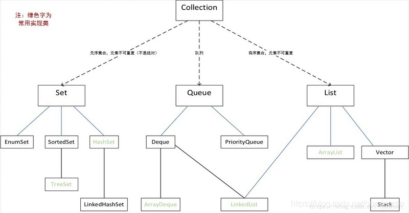

* 可变长字符串一般用StringBuilder，单线程速度快

* Map初始化

  ```java
  Map<Character, String> phoneMap = new HashMap<Character, String>() {{
              put('2', "abc");
              put('3', "def");
              put('4', "ghi");
              put('5', "jkl");
              put('6', "mno");
              put('7', "pqrs");
              put('8', "tuv");
              put('9', "wxyz");
          }};
  ```

* 多重容器初始化

  

  ```java
  List<List<Integer>> rg = new ArrayList<List<Integer>>();
  ```

  队列用法，一般用offer,peek,poll，也可做双端队列，如offerFirst,offerLast,peekFirst,peekLast,pollFirst,pollLast

  ```java
  Queue<Integer> queue = new LinkedList<Integer>();
  ```

* 一般使用hashSet，TreeMap使用时注意这几个函数：firstKey,lastKey,ceilingKey,higherKey,descendingMap等

* Java的map是否包含某个键：hash.containsKey(key)

  Java的map键遍历并得到值：for (String key :hash.keySet()) {hash.get(key);}

  Java将String转换为char[]并排序:char[] c = str.toCharArray();Arrays.sort(c);

  Java的map查找方法：返回值或者返回第二个参数：map.getOrDefault(x, 0)

  Java的sort方法重写：Arrays.sort(B, Comparator.comparingInt(Math::abs)); 

* Integer.bitCount(k1 & Nones); // bitCount统计二进制中1的个数

  Integer.MAX_VALUE;//最大值

  Character.isDigit：判断字符是否为数字