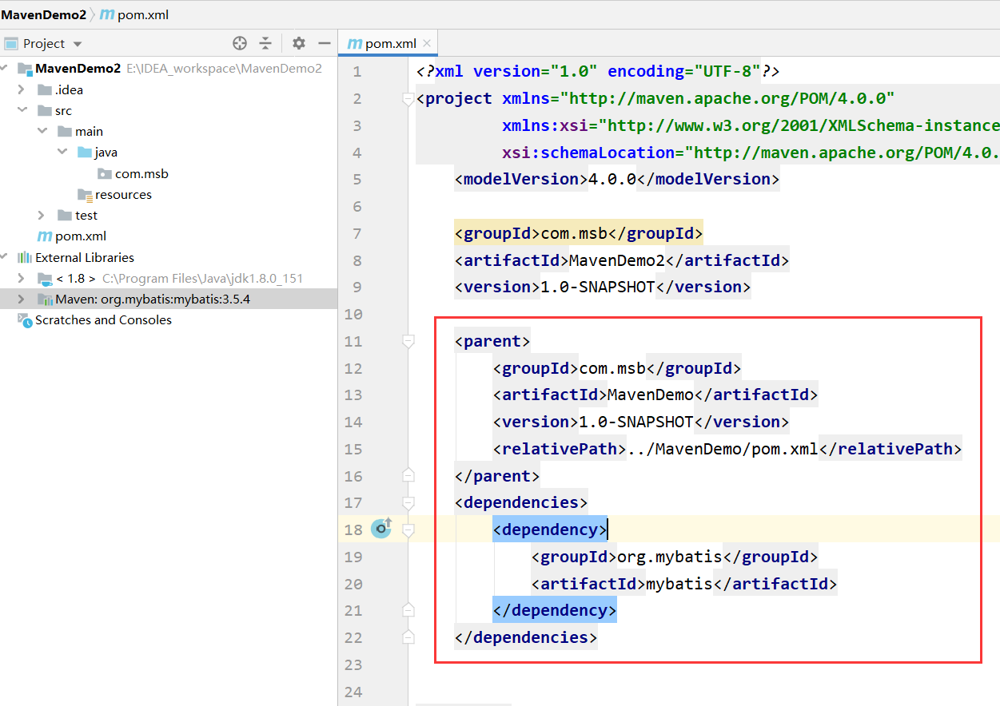

* Idea里的Maven设置


* Settings.xml里可以设置本地仓库与镜像仓库，在settings.xml中：配置了三个信息：
  * 本地仓库
  * 镜像仓库
  * JDK
* 远程仓库mvnrepository.org里面可以搜jar包，并且直接复制粘贴依赖

* Maven使用项目对象模型(POM-Project Object Model,项目对象模型)的概念，可以通过一小段描述信息来管理项目的构建，报告和文档的软件项目管理工具。在Maven中每个项目都相当于是一个对象，对象（项目）和对象（项目）之间是有关系的。关系包含了：依赖、继承、聚合，实现Maven项目可以更加方便的实现导jar包、拆分项目等效果。


* conf目录：下面有一个非常重要的配置文件--》settings.xml---》maven的核心配置文件/全局配置文件。

* 如果没有.m2目录 ，自己手动执行mvn命令：mvn help:system

* 配置使用的JDK或者说编译器的版本：

  * settings.xml文件中配置全局编译器插件，找到profiles节点，在里面加入profile节点：

  * ```xml
    <profile>
                    <!-- 定义的编译器插件ID，全局唯一，名字随便起 -->
                    <id>jdk-1.7</id>
                    <!-- 插件标记，activeByDefault ：true默认编译器，jdk提供编译器版本 -->
                    <activation>
                            <activeByDefault>true</activeByDefault>
                            <jdk>1.7</jdk>
                    </activation>
                    <!-- 配置信息source-源信息，target-字节码信息，compilerVersion-编译过程版本 -->
                    <properties>
                            <maven.compiler.source>1.7</maven.compiler.source>
                            <maven.compiler.target>1.7</maven.compiler.target>
                            <maven.compiler.compilerVersion>1.7</maven.compiler.compilerVersion>
                    </properties>
            </profile>
    ```

  * 配置编译器插件：pom.xml配置片段（局部配置java版本）

  * ```xml
    <!-- 配置maven的编译插件 --> 
    <build>
        <plugins>
        <!--JDK编译插件 -->
              <plugin>
            <!--插件坐标 -->
            <groupId>org.apache.maven.plugins</groupId>
            <artifactId>maven-compiler-plugin</artifactId>
            <version>3.2</version>
             <!-- -->
            <configuration>
              <!-- 源代码使用JDK版本-->
              <source>1.7</source>
               <!-- 源代码编译为class文件的版本，要保持跟上面版本一致-->
              <target>1.7</target>
              <encoding>UTF-8</encoding>
            </configuration>
          </plugin>
        </plugins>
      </build>
    ```

* Maven的命令非常多，我们只是讲解常用的几个：（所有命令都可以在控制台运行的）

  * install：本地安装， 包含编译，打包，安装到本地仓库；编译 - javac；打包 - jar， 将java代码打包为jar文件；安装到本地仓库 - 将打包的jar文件，保存到本地仓库目录中。
  * clean：清除已编译信息；删除工程中的target目录。
  * compile：只编译。 javac命令
  * package：打包。 包含编译，打包两个功能。
  * install和package的区别：package命令完成了项目编译、单元测试、打包功能，但没有把打好的可执行jar包（war包或其它形式的包）布署到本地maven仓库和远程maven私服仓库；install命令完成了项目编译、单元测试、打包功能，同时把打好的可执行jar包（war包或其它形式的包）布署到本地maven仓库，但没有布署到远程maven私服仓库

* Maven工程类型

  * POM工程：POM工程是逻辑工程。用在父级工程或聚合工程中，用来做jar包的版本控制。

  * JAR工程：将会打包成jar，用作jar包使用，即常见的本地工程 ---> Java Project。

  * WAR工程：将会打包成war，发布在服务器上的工程。

  * 我们如果创建war项目，必然要部署在服务器上，方式：

    1. 部署在远程服务器上

    2. 将IDEA和外部tomcat产生关联，然后将项目部署在外部tomcat上

    3. 现在学习一个新的方式，不再依赖外部的tomcat，maven提供了tomcat插件，我们可以直接配置来使用，最后直接关联外部的tomcat。具体pom.xml文件的配置如下：

       ```XML
       <build>
           <plugins>
             <!-- 配置Tomcat插件 -->
             <plugin>
               <groupId>org.apache.tomcat.maven</groupId>
               <artifactId>tomcat7-maven-plugin</artifactId>
               <version>2.2</version>
               <configuration>
            <!-- 配置Tomcat的url及监听端口等 -->
                 <port>8080</port>
            <!-- 配置项目的访问路径(Application Context) -->
                 <path>/</path>
               </configuration>
             </plugin>
           </plugins>
         </build>
       ```

* Maven标准目录结构：

  

  * src：包含了项目所有的源代码和资源文件，以及其他项目相关的文件。

    * src/main/java：这个目录下储存java源代码
    * src/main/resources：储存主要的资源文件，比如xml配置文件和properties文件
    * src/test/java：储存测试用的类，比如JUNIT的测试一般就放在这个目录下面，因为测试类本身实际是不属于项目的，所以放在任何一个包下都显得很尴尬，所以maven专门创建了一个测试包，用于存放测试的类
    * src/test/resources：可以自己创建你，储存测试环境用的资源文件

  * target：编译后内容放置的文件夹

  * pom.xml：是Maven的基础配置文件。配置项目和项目之间关系，包括配置依赖关系等等

  * Maven在打包时默认只将src/main/resources里的配置文件拷贝到项目中并做打包处理，而非resource目录下的配置文件在打包时不会添加到项目中。我们的配置文件，一般都放在：src/main/resources ，然后打包后配置文件就会在target的classes下面放着。我现在想把非resources下面的文件也打包到classes下面，需要配置pom.xml配置片段：

  * ```xml
    <build>
    <resources>
    <resource>
    <directory>src/main/java</directory>
    <includes>
    <include>**/*.xml</include>
    </includes>
    </resource>
    <resource>
    <directory>src/main/resources</directory>
    <includes>
    <include>**/*.xml</include> 
    <include>**/*.properties</include>
    </includes>
    </resource>
    </resources>
    </build>
    ```

* Maven工程关系：依赖，继承，聚合

  * 依赖

    * 第一原则：最短路径优先原则
    * 第二原则：最先声明原则
    * exclusions： 用来排除传递性依赖，其中可配置多个exclusion标签，每个exclusion标签里面对应的有groupId, artifactId, version三项基本元素。注意：不用写版本号。

  * 

  * 依赖范围就决定了你依赖的坐标 在什么情况下有效，什么情况下无效

    * compile：这是默认范围。如果没有指定，就会使用该依赖范围。表示该依赖在编译和运行时都生效。
    * provided：已提供依赖范围。使用此依赖范围的Maven依赖。典型的例子是servlet-api，编译和测试项目的时候需要该依赖，但在运行项目的时候，由于容器已经提供，就不需要Maven重复地引入一遍(如：servlet-api)
    * runtime：runtime范围表明编译时不需要生效，而只在运行时生效。典型的例子是JDBC驱动实现，项目主代码的编译只需要JDK提供的JDBC接口，只有在执行测试或者运行项目的时候才需要实现上述接口的具体JDBC驱动。
    * system：系统范围与provided类似，不过你必须显式指定一个本地系统路径的JAR，此类依赖应该一直有效，Maven也不会去仓库中寻找它。但是，使用system范围依赖时必须通过systemPath元素显式地指定依赖文件的路径。
    * test：test范围表明使用此依赖范围的依赖，只在编译测试代码和运行测试的时候需要，应用的正常运行不需要此类依赖。典型的例子就是JUnit，它只有在编译测试代码及运行测试的时候才需要。Junit的jar包就在测试阶段用就行了，你导出项目的时候没有必要把junit的东西到处去了就，所在在junit坐标下加入scope-test
    * Import：import范围只适用于pom文件中的<dependencyManagement>部分。表明指定的POM必须使用<dependencyManagement>部分的依赖。
      注意：import只能用在dependencyManagement的scope里。

  * 继承

    * 如果A工程继承B工程，则代表A工程默认依赖B工程依赖的所有资源，且可以应用B工程中定义的所有资源信息。

    * 被继承的工程（B工程）只能是POM工程。注意：在父项目中放在<dependencyManagement>中的内容时不被子项目继承，不可以直接使用放在<dependencyManagement>中的内容，主要目的是进行版本管理。里面的内容在子项目中依赖时坐标只需要填写<group id>和<artifact id>即可。（注意：如果子项目不希望使用父项目的版本，可以明确配置version）。

    * 定义一个父工程--》POM工程：

      注意：工程1要打成自己的jar包

    * 定义一个子工程：

    * 如果父工程中加入score-import 相当于强制的指定了版本号：

  * 聚合

    * 当我们开发的工程拥有2个以上模块的时候，每个模块都是一个独立的功能集合。比如某大学系统中拥有搜索平台，学习平台，考试平台等。开发的时候每个平台都可以独立编译，测试，运行。这个时候我们就需要一个聚合工程。

    * 在创建聚合工程的过程中，总的工程必须是一个POM工程（Maven Project）（聚合项目必须是一个pom类型的项目，jar项目war项目是没有办法做聚合工程的），各子模块可以是任意类型模块（Maven Module）。

    * 前提：继承。聚合包含了继承的特性；聚合时多个项目的本质还是一个项目，这些项目被一个大的父项目包含，且这时父项目类型为pom类型；同时在父项目的pom.xml中出现<modules>表示包含的所有子模块。

      

      

