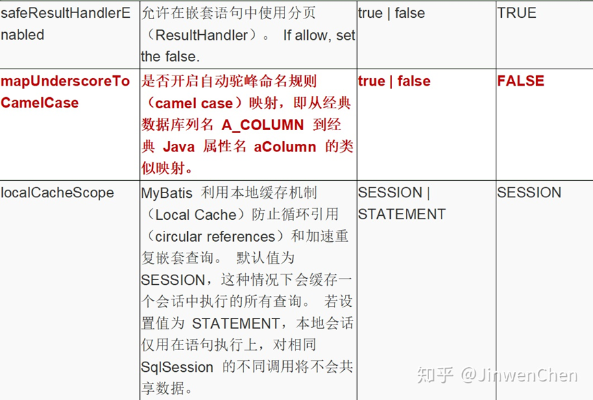
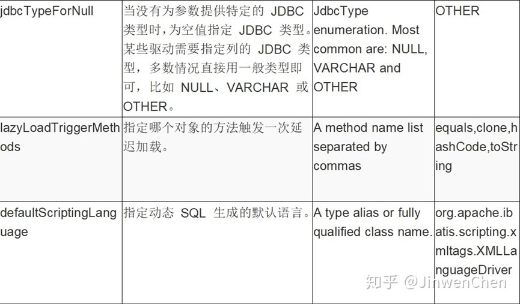

* MyBatis在项目中的使用流程：
  * 导包（MyBatis和数据库驱动的jar包，maven直接解决）。
  * 编写mybatis-config.xml（放在src的resource文件夹中）和xxxMapper.xml配置文件（一般放在对应的mapper（操作接口）目录下。
    * 通常一个项目对应一个数据库实例、而一个数据库实例对应一个mybatis-config.xml配置文件，而项目中的一个模块对应一个xxxMapper.xml配置文件）
    * xxxMapper.xml配置文件中编写模块DAO层接口中的抽象方法的sql语句。每一个方法的实际sql类型对应一个标签（select、insert、update、delete），这样做只是为了将代码语义化，方便后期代码维护。


1. 借助MyBatis封装好的SqlSessionFactoryBuilder对象的build方法构建一个数据库实例的sql会话对象（sqlSession）。注意：build方法需要一个字节输入流（InputStream），是mybatis-config.xml总配置文件的字节输入流（放在对应的util目录下）。

   ```java
   package org.cjw.utils;
   
   import org.apache.ibatis.io.Resources;
   import org.apache.ibatis.session.SqlSession;
   import org.apache.ibatis.session.SqlSessionFactory;
   import org.apache.ibatis.session.SqlSessionFactoryBuilder;
   
   import java.io.IOException;
   import java.io.InputStream;
   
   public class MyBatisUtil {
   
       private MyBatisUtil() {}
   
       private static SqlSessionFactory sqlSessionFactory;
   
       static {
           try(InputStream in = Resources.getResourceAsStream("mybatis-config.xml")) {
               sqlSessionFactory = new SqlSessionFactoryBuilder().build(in);
           } catch (IOException e) {
               e.printStackTrace();
           }
       }
   
       public static SqlSession openSession() {
           return sqlSessionFactory.openSession();
       }
   }
   ```

2. 通过sql会话对象的getMapper方法构建某一模块DAO层的代理对象（底层实现是动态代理）。
3. 通过代理对象调用模块DAO层接口中定义的方法。

* Windows命令行启动mysql:
  1. 管理员身份运行net start mysql
  2. 到相应的bin目录下运行mysql -h 主机名 -u 用户名 -p
  3. 一般先show databases;然后use mysql;接着就建表造数据，然后执行程序搞数据了

* MyBatis的查询结果集都是自动映射封装的，单行查询将数据库一条数据封装成对应的Java对象。多行查询，先将每一行封装成对象，再将每个对象添加到集合中，最后返回一个List集合对象。但是：必须保证查询结果集和pojo对象的属性名相同，否则无法自动封装。
* 问题： 如何解决查询结果集名称和pojo对象属性不同的映射封装？
  * 解决方案：使用手动映射封装 <resultMap>标签；可以使用MyBatis的驼峰命名法，但是也必须遵循一定规则才行。

```xml
<select id="selectUserById" resultMap="user_map">
    select id u_id, name u_name, age u_age, email u_email, password u_password from tb_user where id = #{id}
</select>

<resultMap id="user_map" type="User">
    <id property="id" column="u_id" />
    <result property="name" column="u_name"/>
    <result property="age" column="u_age"/>
    <result property="email" column="u_email"/>
    <result property="password" column="u_password"/>
</resultMap>
```

* 主配置文件说明与细节配置
  * <environments>：环境集标签，就是用于配置数据库的连接信息的
  * <environment>：用于配置具体环境参数。
  * <transactionManager>：配置使用的事务类型，JDBC。    
  * <dataSource>：配置数据源的参数，POOLED。具体参数参看PooledDataSource的set方法。     
  * <property>：配置属性 
  * <mappers>:配置映射文件信息的    
  * <mapper class|resource>:配置具体指定的mapper文件 class:配置使用注解时指定有注解的映射接口 resource:指定映射文件    
  * <package name>:配置配置文件、配置类所在的包，推荐
  * <properties>:MyBatis读取classpath路径下配置文件，一般用于读取db.properties。
  * <typeAliases>:用于配置别名。 
  * <typeAliase type alias>   type:指定取别名的全限定名   alias:别名 
  * <package name>   name:指定取别名的包<typeHandlers>:用于配置自定义类型处理器。
  * <settings>:配置MyBatis的默认设置的（开启二级缓存、驼峰命名自动映射）。

* 总配置文件的标签顺序：<!ELEMENT configuration (properties?, settings?, typeAliases?, typeHandlers?, objectFactory?, objectWrapperFactory?, reflectorFactory?, plugins?, environments?, databaseIdProvider?, mappers?)>

* DTD规则文件标签的出现的次数说明
  * 如果声明的标签后?:表示出现0-1次
  * 如果声明的标签后*:表示出现0-N次
  * 如果声明的标签后+:表示出现1-N次
  * 如果声明的标签后什么都没有:表示出现1次

* 别名typeAliases标签

  * 在UserMapper.xml文件中User无论是作为参数还是作为查询返回数据类型，都需要写上全限定名，实际可以写上简单类名即可，但是需要配置别名。

  * MyBatis框架提供了两种别名机制，一种是自定义别名，一种是内置别名。

  * 自定义别名设置在mybatis-config.xml中

  * ```xml
    <!-- 别名配置 -->
        <typeAliases>
            <!--
                <typeAlias type="" alias=""/>
                    设置单个类型的别名
                    type： 要设置别名的数据类型（全限定名）
                    alias ： 取的别名，一般都使用类的简单名称
                <package name="" />
                    设置一个包的别名，推荐
            -->
            <typeAlias type="org.cjw.pojo.User" alias="User" />
            <package name="org.cjw.pojo"/>
        </typeAliases>
    ```

  * 然后就可以直接在映射文件（UserMapper.xml）中直接使用别名

  * ```xml
    <?xml version="1.0" encoding="UTF-8" ?>
    <!DOCTYPE mapper
     PUBLIC "-//MyBatis.org//DTD Mapper 3.0//EN"
            "http://mybatis.org/dtd/mybatis-3-mapper.dtd">
    <!-- 配置映射
    namespace : 命名空间(通俗说法: 给当前映射文件的唯一标识:起一个唯一的名字)
     -->
    <mapper namespace="org.cjw.mapper.UserMapper">
     <!-- 新增操作
            id: 当前功能的唯一标识,和接口方法同名
            parameterType ： 参数的类型
            useGeneratedKeys：是否返回数据库生成的主键 true是/false否
            keyProperty : 数据库主键对应java的pojo对象的属性
            keyColumn : 数据表的主键列名
         -->
     <insert id="insert" parameterType="User" keyProperty="id" keyColumn="id">
     insert into tb_user (name, age, email, password) values (#{name}, #{age}, #{email}, #{password});
     </insert>
    
        <select id="selectUserById" resultType="User">
     select * from tb_user where id = #{id}
     </select>
    
     <!-- 多行查询
           resultType : 无论是多行查询还是单行查询,返回的结果类型都是对应的JavaBean的类型
        -->
     <select id="selectAll" resultType="User">
     select * from tb_user
     </select>
    
        <delete id="deleteUserById">
     delete from tb_user where id = #{id}
     </delete>
    
        <update id="updateUserById" parameterType="User">
     update tb_user set
            name = #{name}, age = #{age}, email = #{email}, password = #{password}
            where id = #{id}
     </update>
    
    </mapper>
    ```

  * 内置别名 

* settings标签：MyBatis默认设置了很多默认配置。有时候，我们需求与默认的配置的参数不一样，我们就需要修改这些默认配置的参数。如：MyBatis对骆驼命名法的支持默认是不开启的。可以通过mapUnderscoreToCamelCase参数设置为true支持。如支持骆驼命名法
  <settings>
      <setting name="mapUnderscoreToCamelCase" value="true"/>
  </settings>         

* MyBatis提供了下面注解进行映射文件配置
  * @Select 查询数据注解
  * @Insert 插入数据注解
  * @Delete 删除数据注解
  * @Update 修改数据注解
  * @Options 选项配置
  * @Results 手动映射配置
  * @Result： @results中的具体的某一列的映射信息配置

* 在MyBatis框架中支持两种 OGNL语法：#{} ${}
  * #{}基于JDBC的PreparedStatement类，SQL语句参数使用?占位符，在运行阶段动态设置参数，但是?不能作为表名。 预编译语句对象的SQL语句只能操作DML和DQL 语句，不能操作DDL语句。
  * #{}表示设置预编译的参数,就是?的参数,所以如果要不固定的表名不能使用#{},只能使用${}
  * ${}直接把值输出来,直接把参数拼接到SQL语句中.而#{}是使用?来代替. 所以${}是不安全的。
  * ${}只能获得参数池的值,而#{}可以获得方法的参数值,也可以获得参数池的值,如果使用${}获得参数的值,这个参数必须要加上@Param。
  * 如果非必要情况,不要使用${}。
  * 问题：那么${}有什么用呢？
    * 答：注意基于JDBC的接口的原来的表名是不可以使用?的，?只能用于传入的参数。如果操作的涉及表名这些非参数的数据时，需要使用${}。

* 动态SQL语句。
  * Xml方式，标签包括
    * <sql>：用于声明SQL语句块，在操作标签中通过<include>标签引入。
    * <if>：类似java if(){}，用于判断。
    * <foreach>：类似java的foreach循环，一般用于批量处理的SQL语句，如批量更新、插入、删除。
    * <trim>：切割标签，主要用于切割关键字的头和尾的字符。新版Mybatis的使用几率很少。
    * <set>：使用 set标签就是SQL语言的set关键字，可以在update 的时候，设置set 关键字后面的更新字段，逗号可以自动忽略。
    * <where>：使用where标签作为SQL语言的where关键字，如果where后面的条件都不成立,忽略where关键字。
    * <choose> <when><otherwise> : java的if else if... else。
  * Annotation方式

* Mybatis的缓存分为一级缓存、二级缓存。
  * 一级缓存：所谓的一级缓存就是会话(SqlSesion对象)级别的缓存，同一个会话中，如果已经查询过的记录会保存一份在内存中，如果会话没有关闭，再次调用同样的查询方法，不会再查询数据库，而是直接从缓存中取出之前查询的记录（类似get请求的缓存机制）。一级缓存默认是打开的，而且是关闭不了的。
  * 如何清空一级缓存：
    * 关闭会话close()。
    * 进行了DML操作，提交了事务commit()。
    * 手动清除缓存clearCache()。
  * 二级缓存
  * 一级缓存是SqlSession对象级别，在每一次会话中有效。
  * 二级缓存是 SqlSessionFactory级别，在整个应用都有效，可以在多个会话有效。MyBatis本身并没有实现二级缓存
  * 二级缓存需要第三方缓存提供商的支持：Ehcache -第三方缓存(Hibernate框架默认就是支持)