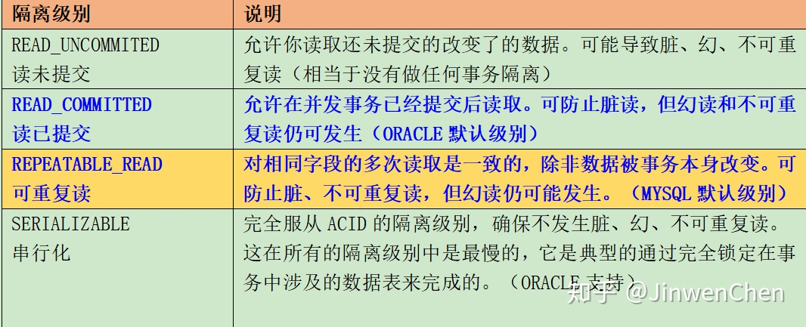
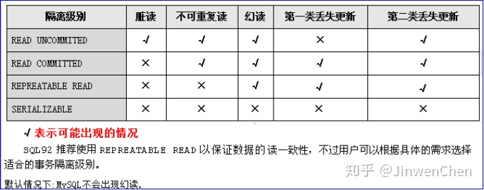
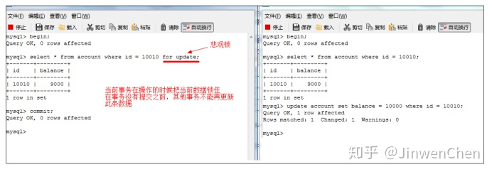

* 并发事务带来哪些问题?
  * 脏读: 当一个事务正在访问数据并且对数据进行了修改，而这种修改还没有提交到数据库中，这时另外一个事务也访问了这个数据，然后使用了这个数据。因为这个数据是还没有提交的数据，那么另外一个事务读到的这个数据是“脏数据”，依据“脏数据”所做的操作可能是不正确的。
  * 不可重复读: 指在一个事务内多次读同一数据。在这个事务还没有结束时，另一个事务也访问该数据。那么，在第一个事务中的两次读数据之间，由于第二个事务的修改导致第一个事务两次读取的数据可能不太一样。这就发生了在一个事务内两次读到的数据是不一样的情况，因此称为不可重复读。
  * 幻读: 幻读与不可重复读类似。它发生在一个事务（T1）读取了几行数据，接着另一个并发事务（T2）插入了一些数据时。在随后的查询中，第一个事务（T1）就会发现多了一些原本不存在的记录，就好像发生了幻觉一样，所以称为幻读。
  * 不可重复读的重点是修改，比如多次读取一条记录发现其中某些列的值被修改；幻读的重点在于新增或者删除，比如多次进行条件查询发现记录增多或减少了。

* 问题：上述问题理论上如果出现了应该如何解决？

  * 答：一般情况，数据库都会处理一些事务并发的问题，数据库提供了不同的事务隔离级别来处理不同的事务并发问题，事务隔离级别定义如下：

    

* 数据库表数据加锁
  * 悲观锁
    1. 在操作当前数据的事务开启事务就使用for update 锁住当前数据。
    2. Hibernate和MyBatis都有悲观锁对应的解决方案。
  * 乐观锁
    1. 为表添加一个version字段。当前事务操作的时候都会比对当前事务的多次操作的版本号是否一致，如果不一致认为数据已经被更新，事务进行回滚。
    2. Hibernate和MyBatis都有乐观锁对应的解决方案。

* 当MySQL单表记录数过大时，数据库的CRUD性能会明显下降，一些常见的优化措施（大表优化）
  * 限定数据的查询范围。务必禁止不带任何限制数据范围条件的查询语句。比如：当用户在查询订单历史的时候，我们可以控制在一个月的范围内；
  * 读写分离（主从模式）经典的数据库拆分方案，主库负责写，从库负责读；
  * 垂直分区垂直分区是指数据表列的拆分，把一张列比较多的表拆分为多张表。
  * 水平分区（集群cluster）保持数据表结构不变，通过某种策略存储数据分片。这样每一片数据分散到不同的表或者库中，达到了分布式的目的。 水平拆分可以支撑非常大的数据量。

* 分库分表之后,id 主键如何处理？
  * 数据库自增id：两台数据库分别设置不同步长，生成不重复ID的策略来实现高可用。这种方式生成的id有序，但是需要独立部署数据库实例，成本高，还会有性能瓶颈。
  * 利用redis 生成id：性能比较好，灵活方便，不依赖于数据库。但是，引入了新的组件造成系统更加复杂，可用性降低，编码更加复杂，增加了系统成本。
  * 利用UUID唯一标识码。

