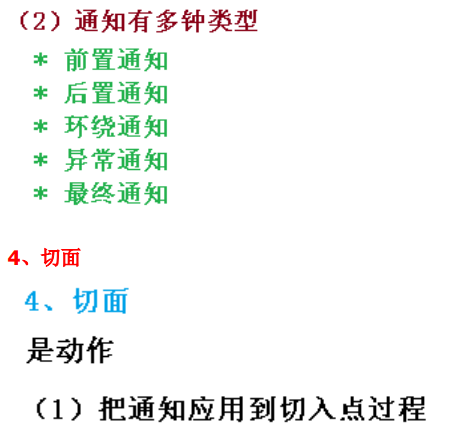
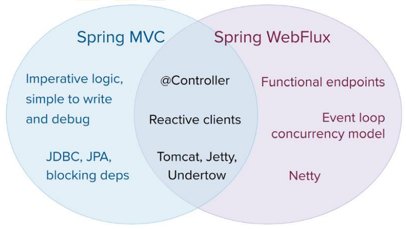

* Spring强调的理念是：轻量级。意味着Spring提供的功能模块，除了内核模块以外，其他功能模块开发人员可以选择性使用。Spring之所以可以实现模块的可插拔是支持依赖注入，所谓的依赖注入就是不用new就可以创建对象。
* Spring的控制反转和依赖注入以及面向切面编程
  * IoC：Inversion of Control（控制反转）:读作“反转控制”，更好理解，不是什么技术，而是一种设计思想，好比于MVC。就是将原本在程序中手动创建对象的控制权，交由Spring框架来管理；正控：若开发者需要使用某个对象，那么就必须通过new关键字来创建该对象；反控：开发者只管从Spring容器中获取需要使用的对象，无需关心对象的创建过程，这也就是把对象的创建控制权反转给了Spring框架。（Don’t call me ,I’ll call you）
  * DI：Dependency Injection（依赖注入）；从字面上分析：IoC：指将对象的创建权，反转给了Spring容器； DI：指Spring创建对象的过程中，将对象依赖的属性（简单值、对象、集合）通过配置信息设置给该对象。IoC和DI其实是同一个概念的不同角度描述，DI相对IoC而言，明确描述了“被注入对象依赖IoC容器配置依赖对象”。
  * Container：容器，在生活中容器就是一种盛放东西的器皿，从程序设计角度看作是装对象的对象，因为存在对对象的存入、取出等操作，所以容器还要管理对象的生命周期。
  * AOP：通俗描述是，不通过修改源代码方式，在主干功能里面添加新功能

* Spring框架容器对象的继承体系
  * IOC 思想基于 IOC 容器完成，IOC 容器底层就是对象工厂
  * Spring 提供 IOC 容器实现两种方式：（两个接口）
    * BeanFactory：IOC 容器基本实现，是 Spring 内部的使用接口，不提供开发人员进行使用。加载配置文件时候不会创建对象，在获取对象（使用）才去创建对象
    * ApplicationContext：BeanFactory 接口的子接口，提供更多更强大的功能，一般由开发人员进行使用。加载配置文件时候就会把在配置文件对象进行创建

* Bean 管理（IOC）

  * Bean 管理指的是两个操作：Spring 创建对象；Spirng 注入属性

  * 基于xml

    1. 创建一个普通类。
    2. 创建一个Spring配置文件，用于描述类与类之间的关系。
    3. 创建ApplicationContext容器对象，根据Spring配置文件的描述，创建对象并放在Spring容器里面。
    4. 使用ApplicationContext容器对象的getBean方法，获取Spring容器里面的对象。
       ClassPathXmlApplicationContext:通过classpath路径（相对路径）直接获得加载的xml文件（推荐使用）；FileSystemXmlApplicationContext：通过文件路径（绝对路径）来获得加载的xml文件。

  * 完全注解开发

  * ```java
    （1）创建配置类，替代 xml 配置文件
    @Configuration //作为配置类，替代 xml 配置文件
    @ComponentScan(basePackages = {"com.atguigu"})
    public class SpringConfig {
    }
    （2）编写测试类
    @Test
    public void testService2() {
     //加载配置类
     ApplicationContext context
     = new AnnotationConfigApplicationContext(SpringConfig.class);
     UserService userService = context.getBean("userService", 
    UserService.class);
     System.out.println(userService);
     userService.add();
    }
    ```

* Spring创建对象的四种方式
  1. 构造器实例化（无参数构造器），最标准，使用最多。
  2. 通过静态方法工厂创建
  3. 通过实体工厂创建
  4. 实现FactoryBean接口实例化

* 工厂 bean：在配置文件定义 bean 类型可以和返回类型不一样
  * 第一步 创建类，让这个类作为工厂 bean，实现接口 FactoryBean
  * 第二步 实现接口里面的方法，在实现的方法中定义返回的 bean 类型
* 实现FactoryBean接口，MyBatis和Spring集成就是使用的这种方式。此种方式，如果没有使用Bean对应的对象，Spring就不会自动创建，只有在使用的时候Spring才会创建对应的对象。

* 在基于注解的配置中，我们还要多拷贝一个aop的jar包

* 基于注解整合时，Spring配置文件导入约束时需要多导入一个context命名空间下的约束。

* 默认情况下，被注解@Component 扫描的类的名称就是当前类名的首字母小写名称，开发者可以自定义组件的名称。

* 我们将用于被扫描创建对象的注解，统称为组件注解。组件包括：@Controller、@Service、@Repository、@Component。

* 组件注解的功能就是标识那些在Spring框架启动时，需要创建对象并保存在IOC容器中的类。意味着，只有加了这四个注解中的任何一个注解的类，在Spring框架启动的时候，Spring就通过配置文件指定的路径将该路径下的所有带组件注解的类创建对象并且放在容器里面。组件注解的功能类似原来配置文件的<bean>标签。

* 问题：明明一个@Component注解就可以满足了扫描的需要，为什么要有四个呢？

  * 答：其实Spring第一版注解的实现（spring 2.5），只有@Component组件注解。从spring3.0以后，作者认为根据分层的需要，把它拆成了四个。为了可以让开发人员，可见即可得，一看到注解，立即知道类的性质。所以分成了四个。

    @Controller：用于声明表示层的组件注解
    @Service:用于声明服务层的组件注解
    @Repository：用于声明持久层的组件注解
    @Component：用于声明三层以外的组件注解

* 问题：那么，这四个注解交换使用会报错吗。如：持久层，我放@Service标记。

  * 答：@Controller在SpringMVC里面有强制的要求，SpringMVC的表示层必须使用@Controller组件注解。其他情况，用乱了是不会报错的，不过我们必须不能用乱。不遵守规范，不然别人就无法跟我们一起开发了。

* 注册Bean到IOC容器大致分为4种：
  1. 包扫描+组件注解（@Controller、@Service、@Repository、@Component）针对类是我们自己编写的情况
  2. @Bean注解针对导入第三方包里面的类的情况
  3. @Import  针对快速导入某一个类的情况，如仅仅只是调用无参构造创建对象。
     * @Import注解直接导入
     * ImportSelector手动导入Bean到容器中
     * ImportBeanDefinitionRegistrar手动注册bean到容器中
  4. FactoryBean（Bean工厂）
     * 默认获取到的是工厂bean调用getObject方法创建的对象
     * 要获取工厂bean本身，我们需要给id前面加一个&（&FactoryBean）

* 作用范围也可以说生命周期（bean能存活多久）bean 生命周期
  1. 通过构造器创建 bean 实例（无参数构造）
  2. 为 bean 的属性设置值和对其他 bean 引用（调用 set 方法）
  3. 把 bean 实例传递 bean 后置处理器的方法 postProcessBeforeInitialization 
  4. 调用 bean 的初始化的方法（需要进行配置初始化的方法）
  5. 把 bean 实例传递 bean 后置处理器的方法 postProcessAfterInitialization
  6. bean 可以使用了（对象获取到了）
  7. 当容器关闭时候，调用 bean 的销毁的方法（需要进行配置销毁的方法）

* 如果使用注解配置bean，那么bean的作用范围也需要使用注解配置。@Scope("作用范围")
  * singleton：单例，在ioc容器中仅存在一个Bean实例（默认的scope）。
  * prototype：多例，每次从容器中调用Bean时，都返回一个新的实例，即每次调用getBean()时 ，相当于执行newInstance()，并且ioc容器不会管理多例对象。
  * request：用于web开发，将Bean放入request作用域中，request.setAttribute("xxx") ， 在同一个request对象中获取同一个Bean。
  * session：用于web开发，将Bean 放入Session作用域中，在同一个Session对象中获取同一个Bean。
  * 对于MVC中的Action/Controller使用prototype类型，其他使用singleton。
  * 分析原理:如果bean的scope="prototype",那么容器只负责创建和初始化，它并不会被spring容器管理。交给用户自己调用。
  * 单例和多例的使用判断准则：是否存在共享数据情况，如果有，使用多例，没有则单例。如果使用了单例还存在共享数据的情况，那么就需要使用锁来保证数据的正确性。

* 初始化和销毁方法
  * init-method：bean生命周期初始化方法,对象创建后就进行调用
  * destroy-method:容器被销毁的时候，如果bean被容器管理，会调用该方法。
  * default-init-method：指定默认的初始化方法

* Spirng 注入属性
  1. setter注入,(也可以称之为属性注入)
  2. 构造器注入（有参数构造）
  3. p命名空间注入
  4. 集合类型值注入
* 获得properties文件的值
  * Spring配置文件支持通过xxx.properties文件的Key获得对应的值。实现该功能是通过通过${Key}来获得Properties文件指定Key的Value值。使用Spring读取配置文件必须导入新的命名空间（context）。
  * 导入命名空间方法：将命名空间和约束重新拷贝一份，将对应的全部替换成 context，然后关联context本地schema约束。
* property标签中的value属性只能注入基本数据类型、包装类型、String类型。
  * @Value注解：注入基本数据类型以及它们的包装类和String类型数据的，支持${}注入properties文件的键值对，等同 <proprty name="..." value="${Key}" />。
* Spring提供了两套注解可以解决对象依赖注入的方案：
  1. @Autowired +@Qualifier():是Spring定义的标签
     * @Autowired注解：用于标识需要依赖注入的对象属性。
       1. @Autowired注解贴在字段或者setter方法上。
       2. 默认情况下@Autowired注解必须要能找到对应的对象，否则报错。不过，可使用required=false来避免该问题：@Autowired(required=false)
       3. @Autowired找bean的方式：
          1. 首先按照依赖对象的类型找，如果只找到一个则使用字段或者setter方法直接注入。
          2. 如果在Spring上下文中找到多个匹配的类型，则再按照名字去找，如果没有匹配则报错（NoSuchBeanDefinitionException）。
          3. 可以通过使用@Qualifier("otherBean")注解来规定依赖对象按照类型+bean的id去找。
  2. @Resouce:是JavaEE的规范2.2.1. 
     
* 我们发现，之所以我们现在离不开xml配置文件，是因为我们有一句很关键的配置：
  <!-- 告知spring框架，读取配置文件，创建容器时，扫描注解，依据注解创建对象，并存入IOC容器中 --><context:component-scan base-package="cn.zj.spring" />；如果他要是也能用注解配置，那么我们就可以脱离xml文件了。；通过@Configuration注解和@ComponentScan注解 

* 如果使用Spring测试，必须使用两个注解：
  * @RunWith注解：表示先启动Spring容器，把junit运行在Spring容器中
  * @ContextConfiguration注解：加载资源文件，默认从src(源目录)下面加载

* 重复性代码解决：动态代理（AOP） 

  1. JDK的动态代理 - Java官方。
     * 使用JDK官方的Proxy类创建代理对象：
       1. 需要通过Proxy类创建代理对象。
       2. 创建代理对象必须要有一个代理处理类（实现接口InvocationHandler的类）
     * JDK动态代理的不足
       1. JDK动态代理的对象必须要实现接口，因为JDK动态代理是基于接口代理的。
       2. 需要为每个对象创建代理对象。
       3. 代理粒度大，动态代理的最小单位是类(所有类中的方法都会被处理)，但是查询方法不需要事务，因此不需要被代理。
  2. CGLIB动态代理 -第三方组织开源。
     * CGLIB(Code Generation Library)是一个开源项目。CGLIB和JDK动态代理一样都是动态代理，但是CGLIB可以代理没有实现接口的类。CGLIB代理没有实现接口的类时，程序在JVM运行过程中动态的为这个类创建一个子类，并重写父类方法，在调用父类方法时，在方法执行之前、之后、异常、最终做增强。Spring默认已经集成CGLIB代理,直接可以使用即可,不用拷贝任何jar包。
     * CGLIB代理的不足
       1. CGLIB可以标类的子类，并重写父类非final修饰符的方法。
       2. 要求类不能是final的，要代理的方法要是非final、非static、非private的。
       3. 动态代理的最小单位是类(所有类中的方法都会被处理)。
  3. Spring的AOP技术(底层就是JDK动态代理和CGLIB代理技术)。

  * 动态代理模式的缺陷是：
    1. 实现类必须要实现接口 -JDK动态代理
    2. 无法通过规则制定拦截无需功能增强的方法。
  * Spring-AOP主要弥补了第二个不足，通过规则设置来拦截方法，并对方法做统一的增强。
  * 在spring中，框架会根据目标类是否实现了接口来决定采用哪种动态代理的方式。如果类实现类接口，那么使用JDK动态代理，否则使用CGLIB动态代理。
  * AOP 思想必须使用AspectJ语法，而AOP思想不是Spring框架设计出来的，而是叫一个AOP联盟组织提出这种思想，所以开发者需要导入AOP联盟提供的 aspectj.weaver.jar（aspectweaver织入包）。

* 注解开发

  1. 创建类，在类里面定义方法，使用注解（如@Component）创建 User 和 UserProxy 对象
  2. 创建增强类（编写增强逻辑），在增强类上面添加注解 @Aspect，在增强类里面，创建方法，让不同方法代表不同通知类型
  3. 进行通知的配置，在 spring 配置文件中，开启注解扫描，在 spring 配置文件中开启生成代理对象；也可创建配置类，不需要创建 xml 配置文件@Configuration，@ComponentScan(basePackages = {"xxx.xxx"})，@EnableAspectJAutoProxy(proxyTargetClass = true)
  4. 配置不同类型的通知，在增强类的里面，在作为通知方法上面添加通知类型注解，使用切入点表达式配置；也可配置相同的切入点抽取。
  5. 有多个增强类多同一个方法进行增强，设置增强类优先级，在增强类上面添加注解@Order(数字类型值)，数字类型值越小优先级越高

* 切入点表达式

  * 切入点表达式作用：知道对哪个类里面的哪个方法进行增强
  * 语法结构： execution([权限修饰符] [返回类型] [类全路径] [方法名称]([参数列表]) )
    * 全匹配方式：public void org.cjw.service.impl.CustomerServiceImpl.saveCustomer()
      访问修饰符可以省略：void org.cjw.service.impl.CustomerServiceImpl.saveCustomer()
      返回值可以使用*号，表示任意返回值： * org.cjw.service.impl.CustomerServiceImpl.saveCustomer()
      包名可以使用*号，表示任意包，但是有几级包，需要写几个*：* *.*.*.*.CustomerServiceImpl.saveCustomer()
      使用..来表示当前包，及其子包：* org..CustomerServiceImpl.saveCustomer()
      类名可以使用*号，表示任意类： * org..*.saveCustomer()
      方法名可以使用*号，表示任意方法：* org..*.*()
      参数列表可以使用*，表示参数可以是任意数据类型，但是必须有参数： * org..*.*(*)
      参数列表可以使用..表示有无参数均可，有参数可以是任意类型： * org..*.*(..)
      全通配方式：* *..*.*(..)

* Xml开发常用标签说明 

  * <aop:config>作用：用于声明aop配置
  * <aop:aspect>作用： 用于配置切面。属性：     id：给切面一个唯一标识。     ref：引用配置好的切面类bean的id。
  * <aop:pointcut>作用：用于配置切入点表达式属性：     id：用于给切入点表达式一个唯一标识。     expression：用于定义切入点表达式。
  * <aop:before>作用：用于配置前置通知属性：     method：指定通知中方法的名称。     pointct：定义切入点表达式     pointcut-ref：指定切入点表达式的引用
  * <aop:after-returning>作用：用于配置后置通知，如果出了异常就一定不会调用切面的方法属性：     method：指定通知中方法的名称。     pointct：定义切入点表达式     pointcut-ref：指定切入点表达式的引用
  * <aop:after-throwing>作用： 用于配置异常通知，只有出了异常才会调用切面对应的方法属性：     method：指定通知中方法的名称。     pointct：定义切入点表达式     pointcut-ref：指定切入点表达式的引用
  * <aop:after>作用：用于配置最终通知，不管出不出异常，都调用切面的方法属性：     method：指定通知中方法的名称。     pointct：定义切入点表达式     pointcut-ref：指定切入点表达式的引用
  * <aop:around>作用：用于配置环绕通知属性：     method：指定通知中方法的名称。     pointct：定义切入点表达式     pointcut-ref：指定切入点表达式的引用

* 注解开发常用注解

  * @Aspect作用：把当前类声明为切面类。
  * @Before作用：把当前方法看成是前置通知。属性：     value：用于指定切入点表达式，还可以指定切入点表达式的引用。
  * @AfterReturning作用：把当前方法看成是最终通知。报异常，就不执行。属性：      value：用于指定切入点表达式，还可以指定切入点表达式的引用。
  * @AfterThrowing作用：把当前方法看成是异常通知。只有报异常才执行属性：     value：用于指定切入点表达式，还可以指定切入点表达式的引用。
  * @After作用：把当前方法看成是后置通知。不管报不报异常都执行属性：      value：用于指定切入点表达式，还可以指定切入点表达式的引用。
  * @Around作用：把当前方法看成是环绕通知。属性：     value：用于指定切入点表达式，还可以指定切入点表达式的引用。
  * @Pointcut作用：指定切入点表达式属性：     value：指定表达式的内容

* JdbcTemplate：Spring 框架对 JDBC 进行封装，使用 JdbcTemplate 方便实现对数据库操作

  1. 引入相关 jar 包
  2. 在 spring 配置文件配置数据库连接池dataSource
  3. 配置 JdbcTemplate 对象，注入 dataSource
  4. 对应数据库创建实体类
  5. 创建 service 类，在service注入dao
  6. 创建 dao 类，在 dao 注入 jdbcTemplate 对象，在 dao 进行数据库添加操作

* Spring事务：Spring支持编程式事务管理和声明式事务管理。

  * 编程式事务管理：事务和业务代码耦合度太高。

  * 声明式事务管理：侵入性小，把事务从业务代码中抽离出来，使用AOP配置到配置文件中，提高维护性。

  * 在 Spring 进行声明式事务管理，底层使用 AOP 原理

  * ```xml
    1、在 spring 配置文件配置事务管理器
    <!--1 创建事务管理器-->
    <bean id="transactionManager" 
    class="org.springframework.jdbc.datasource.DataSourceTransactionManager">
     <!--注入数据源-->
     	<property name="dataSource" ref="dataSource"></property>
    </bean>
    2、在 spring 配置文件，开启事务注解
    （1）在 spring 配置文件引入名称空间 tx
    （2）开启事务注解 <!--2 配置通知-->
    <tx:advice id="txadvice">
     <!--配置事务参数-->
    <tx:attributes>
     		<!--指定哪种规则的方法上面添加事务-->
     		<tx:method name="accountMoney" propagation="REQUIRED"/>
    <!--<tx:method name="account*"/>-->
    </tx:attributes>
    </tx:advice>
    3、在 service 类上面（或者 service 类里面方法上面）添加事务注解
    （1）@Transactional，这个注解添加到类上面，也可以添加方法上面
    （2）如果把这个注解添加类上面，这个类里面所有的方法都添加事务
    （3）如果把这个注解添加方法上面，为这个方法添加事务
    ```

  * 说明：首先切入点为业务层的所有方法，但是查询方法是不需要事务的，所以我们需要在事务管理器里面设置哪些方法需要使用事务管理（DML操作，除了查询以外），哪些方法无需（查询方法）。<tx:method>标签就是用于过滤方法的，当设置为read-only=true时，表示这个方法是查询，无需使用事务管理器，相反，则需要。

  * 在 service 类上面添加注解@Transactional，在这个注解里面可以配置事务相关参数

  * propagation：事务传播行为 

  * ioslation：事务隔离级别

  * timeout：超时时间

    * 事务需要在一定时间内进行提交，如果不提交进行回滚
    * 默认值是 -1 ，设置时间以秒单位进行计算

  * readOnly：是否只读

    * 读：查询操作，写：添加修改删除操作
    * readOnly 默认值 false，表示可以查询，可以添加修改删除操作
    * 设置 readOnly 值是 true，设置成 true 之后，只能查询

  * rollbackFor：回滚，设置出现哪些异常进行事务回滚

  * noRollbackFor：不回滚，设置出现哪些异常不进行事务回滚

* Xml配置 : 代码清晰,配置量少,容易维护；注解配置 : 侵入代码,每个Service层类都得配置,针对不同的方法还得配置事务细节:如查询方法配置只读操作,不容易维护

* 

* Spring 事务管理 API，提供一个接口，代表事务管理器，这个接口针对不同的框架提供不同的实现类

* TransactionDefinition该接口主要定义了：事务的传播行为（规则），事务的隔离级别，获得事务信息的方法。所以在配置事务的传播行为，事务的隔离级别，需要获得事务信息时，可以通过查阅该类的代码获得相关信息。

* PlatformTransactionManager接口主要定义事务的处理方法，获取事务，开启事务，提交事务，回滚事务，在实际开发中不同的框架有不同的实现类。

* Spring的事务管理：

  * PlatformTransactionManager:接口统一抽象处理事务操作相关的方法
    * TransactionStatus getTransaction(TransactionDefinition definition)： 根据事务定义信息从事务环境中返回一个已存在的事务，或者创建一个新的事务，并用TransactionStatus描述该事务的状态。 
    * void commit(TransactionStatus status)： 根据事务的状态提交事务，如果事务状态已经标识为rollback-only，该方法执行回滚事务的操作。 
    * void rollback(TransactionStatus status)： 事务回滚，当commit方法抛出异常时，rollback会被隐式调用

  * 在使用spring管理事务的时候，首先得告诉spring使用哪一个事务管理器，使用不同的框架(JdbcTemplate,MyBatis,Hibernate/JPA )，使用事务管理器都不同。

* Spring5新功能

  * 整个 Spring5 框架的代码基于 Java8，运行时兼容 JDK9，许多不建议使用的类和方法在代码库中删除

  * Spring 5.0 框架自带了通用的日志封装 

    * Spring5 已经移除 Log4jConfigListener，官方建议使用 Log4j2

    * Spring5 框架整合 Log4j2

    * ```xml
      第一步 引入 jar 包
      第二步 创建 log4j2.xml 配置文件
      <?xml version="1.0" encoding="UTF-8"?>
      <!--日志级别以及优先级排序: OFF > FATAL > ERROR > WARN > INFO > DEBUG > TRACE > ALL -->
      <!--Configuration 后面的 status 用于设置 log4j2 自身内部的信息输出，可以不设置，当设置成 trace 时，可以看到 log4j2 内部各种详细输出-->
      <configuration status="INFO">
       <!--先定义所有的 appender-->
       <appenders>
       <!--输出日志信息到控制台-->
       <console name="Console" target="SYSTEM_OUT">
       <!--控制日志输出的格式-->
       <PatternLayout pattern="%d{yyyy-MM-dd HH:mm:ss.SSS} [%t] %-5level %logger{36} - %msg%n"/>
       </console>
       </appenders>
       <!--然后定义 logger，只有定义 logger 并引入的 appender，appender 才会生效-->
       <!--root：用于指定项目的根日志，如果没有单独指定 Logger，则会使用 root 作为默认的日志输出-->
       <loggers>
       <root level="info">
       <appender-ref ref="Console"/>
       </root>
      </loggers>
      </configuration>
      ```

  * Spring5 框架核心容器支持@Nullable注解：@Nullable 注解可以使用在方法上面，属性上面，参数上面，表示方法返回可以为空，属性值可以为空，参数值可以为空

  * Spring5 核心容器支持函数式风格 GenericApplicationContext

  * Spring5 支持整合 JUnit5

    * Junit4写法
      @RunWith(SpringJUnit4ClassRunner.class) //单元测试框架
      @ContextConfiguration("classpath:bean1.xml") //加载配置文件
    * Junit5写法
      @ExtendWith(SpringExtension.class)
      @ContextConfiguration("classpath:bean1.xml")

* SpringWebflux是 Spring5 添加新的模块，用于 web 开发的，功能和 SpringMVC 类似的，Webflux 使用当前一种比较流程响应式编程出现的框架。
* 使用传统 web 框架，比如 SpringMVC，这些基于 Servlet 容器，Webflux 是一种异步非阻塞的框架，异步非阻塞的框架在 Servlet3.1 以后才支持，核心是基于 Reactor 的相关 API 实现的。
  * 两个框架都可以使用注解方式，都运行在 Tomet 等容器中
  * SpringMVC 采用命令式编程，Webflux 采用异步响应式编程

* 响应式编程是一种面向数据流和变化传播的编程范式。这意味着可以在编程语言中很方便地表达静态或动态的数据流，而相关的计算模型会自动将变化的值通过数据流进行传播。电子表格程序就是响应式编程的一个例子。单元格可以包含字面值或类似"=B1+C1"的公式，而包含公式的单元格的值会依据其他单元格的值的变化而变化。

* 响应式编程（Reactor 实现）

  * 响应式编程操作中，Reactor 是满足 Reactive 规范框架
  * Reactor 有两个核心类，Mono 和 Flux，这两个类实现接口 Publisher，提供丰富操作符。Flux 对象实现发布者，返回 N 个元素；Mono 实现发布者，返回 0 或者 1 个元素
  * Flux 和 Mono 都是数据流的发布者，使用 Flux 和 Mono 都可以发出三种数据信号：元素值，错误信号，完成信号，错误信号和完成信号都代表终止信号，终止信号用于告诉订阅者数据流结束了，错误信号终止数据流同时把错误信息传递给订阅者
  * 三种信号特点
    * 错误信号和完成信号都是终止信号，不能共存的
    * 如果没有发送任何元素值，而是直接发送错误或者完成信号，表示是空数据流
    * 如果没有错误信号，没有完成信号，表示是无限数据流 
  * SpringWebflux 执行过程和 SpringMVC 相似的
    * SpringWebflux 核心控制器 DispatchHandler，实现接口 WebHandler
    * 接口 WebHandler 有一个方法
  * SpringWebflux 里面 DispatcherHandler，负责请求的处理
    * HandlerMapping：请求查询到处理的方法
    * HandlerAdapter：真正负责请求处理
    * HandlerResultHandler：响应结果处理

  * SpringWebflux 实现函数式编程，两个接口：RouterFunction（路由处理）和 HandlerFunction（处理函数）
  * SpringMVC 方式实现，同步阻塞的方式，基于 SpringMVC+Servlet+Tomcat
  * SpringWebflux 方式实现，异步非阻塞 方式，基于 SpringWebflux+Reactor+Netty 
  * SpringWebflux（基于函数式编程模型）
    * 在使用函数式编程模型操作时候，需要自己初始化服务器
    * 基于函数式编程模型时候，有两个核心接口：RouterFunction（实现路由功能，请求转发给对应的 handler）和 HandlerFunction（处理请求生成响应的函数）。核心任务定义两个函数式接口的实现并且启动需要的服务器。
    * SpringWebflux请求和响应不再是ServletRequest和ServletResponse而是ServerRequest 和 ServerResponse

* SpringMVC就是一个Spring内置的MVC框架。MVC框架，它解决WEB开发中常见的问题(参数接收、文件上传、表单验证、国际化等等)，而且使用简单，与Spring无缝集成。支持 RESTful风格的URL请求。采用了松散耦合可插拔组件结构，比其他 MVC 框架更具扩展性和灵活性。

* MVC分别是：模型model(javabean)、视图view(jsp/img)、控制器Controller(Action/servlet)。C存在的目的就是为了保证M和V的一致性，当M发生改变时，C可以把M中的新内容更新到V中。

* SpringMVC执行流程和原理

* SpringMVC执行流程：
  1. 用户发送出请求被前端控制器DispatcherServlet拦截进行处理。
  2. DispatcherServlet收到请求调用HandlerMapping（处理器映射器）。
  3. HandlerMapping找到具体的处理器(查找xml配置或注解配置)，生成处理器对象及处理器拦截器(如果有)，再一起返回给DispatcherServlet。
  4. DispatcherServlet调用HandlerAdapter（处理器适配器）。
  5. HandlerAdapter经过适配调用具体的处理器（Handler/Controller）。
  6. Controller执行完成返回ModelAndView对象。
  7. HandlerAdapter将Controller执行结果ModelAndView返回给DispatcherServlet。
  8. DispatcherServlet将ModelAndView传给ViewReslover（视图解析器）。
  9. ViewReslover解析ModelAndView后返回具体View（视图）给DispatcherServlet。
  10. DispatcherServlet根据View进行渲染视图（即将模型数据填充至视图中）。
  11. DispatcherServlet响应View给用户。
* 涉及组件分析：
  1. 前端控制器DispatcherServlet（不需要程序员开发）由框架提供，在web.xml中配置。
     作用：接收请求，响应结果，相当于转发器，中央处理器。
  2. 处理器映射器HandlerMapping（不需要程序员开发）由框架提供。
     作用：根据请求的url查找Handler（处理器/Controller），可以通过XML和注解方式来映射。
  3. 处理器适配器HandlerAdapter（不需要程序员开发）由框架提供。
     作用：按照特定规则（HandlerAdapter要求的规则）去执行Handler中的方法。
  4. 处理器Handler（也称之为Controller，需要程序员开发）
     注意：编写Handler时按照HandlerAdapter的要求去做，这样适配器才可以去正确执行Handler。
     作用：接受用户请求信息，调用业务方法处理请求，也称之为后端控制器。
  5. 视图解析器ViewResolver（不需要程序员开发）由框架提供。
     作用：进行视图解析，把逻辑视图解析成真正的物理视图。 
     SpringMVC框架支持多种View视图技术，包括：jstlView、freemarkerView、ThymeleafView等。
  6. 视图View（需要工程师开发）
     作用：把数据展现给用户的页面
     View是一个接口，实现类支持不同的View技术（jsp、freemarker、pdf等）
* DispatcherServlet初始化过程
  * DispatcherServlet 本质上是一个 Servlet，所以天然的遵循 Servlet 的生命周期。所以宏观上是 Servlet生命周期来进行调度。 
    * 初始化WebApplicationContext
    * 创建WebApplicationContext
    * DispatcherServlet初始化策略
      * FrameworkServlet创建WebApplicationContext后，刷新容器，调用onRefresh(wac)，此方法在DispatcherServlet中进行了重写，调用了initStrategies(context)方法，初始化策略，即初始化DispatcherServlet的各个组件
* DispatcherServlet调用组件处理请求
  * processRequest() 
  * doService()
  * doDispatch()
  * processDispatchResult()
* SpringMVC的执行流程
  1. 用户向服务器发送请求，请求被SpringMVC 前端控制器 DispatcherServlet捕获。
  2. DispatcherServlet对请求URL进行解析，得到请求资源标识符（URI），判断请求URI对应的映射：不存在， 再判断是否配置了mvc:default-servlet-handler；如果没配置，则控制台报映射查找不到，客户端展示404错误 b) 存在则执行下面的流程
  3. 根据该URI，调用HandlerMapping获得该Handler配置的所有相关的对象（包括Handler对象以及Handler对象对应的拦截器），最后以HandlerExecutionChain执行链对象的形式返回。
  4. DispatcherServlet 根据获得的Handler，选择一个合适的HandlerAdapter。
  5. 如果成功获得HandlerAdapter，此时将开始执行拦截器的preHandler(…)方法【正向】
  6. 提取Request中的模型数据，填充Handler入参，开始执行Handler（Controller)方法，处理请求。在填充Handler的入参过程中，根据你的配置，Spring将帮你做一些额外的工作：
     * HttpMessageConveter： 将请求消息（如Json、xml等数据）转换成一个对象，将对象转换为指定的响应信息
     * 数据转换：对请求消息进行数据转换。如String转换成Integer、Double等
     * 数据格式化：对请求消息进行数据格式化。 如将字符串转换成格式化数字或格式化日期等
     * 数据验证： 验证数据的有效性（长度、格式等），验证结果存储到BindingResult或Error中
  7. Handler执行完成后，向DispatcherServlet 返回一个ModelAndView对象。
  8. 此时将开始执行拦截器的postHandle(...)方法【逆向】。
  9. 根据返回的ModelAndView（此时会判断是否存在异常：如果存在异常，则执行
     HandlerExceptionResolver进行异常处理）选择一个适合的ViewResolver进行视图解析，根据Model和View，来渲染视图。
  10. 渲染视图完毕执行拦截器的afterCompletion(…)方法【逆向】。
  11. 将渲染结果返回给客户端。
* @RequestMapping
  * @RequestMapping标识一个类：设置映射请求的请求路径的初始信息
  * @RequestMapping标识一个方法：设置映射请求请求路径的具体信息
  * @RequestMapping注解的value属性通过请求的请求地址匹配请求映
  * @RequestMapping注解的value属性是一个字符串类型的数组，表示该请求映射能够匹配多个请求地址所对应的请求
  * @RequestMapping注解的method属性通过请求的请求方式（get或post）匹配请求映射
  * @RequestMapping注解的method属性是一个RequestMethod类型的数组，表示该请求映射能够匹配多种请求方式的请求
  * @RequestMapping注解的params属性通过请求的请求参数匹配请求映
  * @RequestMapping注解的params属性是一个字符串类型的数组，可以通过四种表达式设置请求参数和请求映射的匹配关系
    * "param"：要求请求映射所匹配的请求必须携带param请求参数
    * "!param"：要求请求映射所匹配的请求必须不能携带param请求参数
    * "param=value"：要求请求映射所匹配的请求必须携带param请求参数且param=value
    * "param!=value"：要求请求映射所匹配的请求必须携带param请求参数但是param!=value
  * @RequestMapping(value = {"/testRequestMapping", "/test"},method = {RequestMethod.GET, RequestMethod.POST},params = {"username","password!=123456"})
  * @RequestMapping注解的headers属性通过请求的请求头信息匹配请求映射
  * @RequestMapping注解的headers属性是一个字符串类型的数组，可以通过四种表达式设置请求头信息和请求映射的匹配关系
    * "header"：要求请求映射所匹配的请求必须携带header请求头信息
    * "!header"：要求请求映射所匹配的请求必须不能携带header请求头信息
    * "header=value"：要求请求映射所匹配的请求必须携带header请求头信息且header=value
    * "header!=value"：要求请求映射所匹配的请求必须携带header请求头信息且header!=value
  * 若当前请求满足@RequestMapping注解的value和method属性，但是不满足headers属性，此时页面显示404错误，即资源未找到
* 对于处理指定请求方式的控制器方法，SpringMVC中提供了@RequestMapping的派生注解
  * 处理get请求的映射-->@GetMapping
  * 处理post请求的映射-->@PostMapping
  * 处理put请求的映射-->@PutMapping
  * 处理delete请求的映射-->@DeleteMapping
* SpringMVC支持ant风格的路径，SpringMVC路径中的占位符常用于RESTful风格中，当请求路径中将某些数据通过路径的方式传输到服务器中，就可以在相应的@RequestMapping注解的value属性中通过占位符{xxx}表示传输的数据，在通过@PathVariable注解，将占位符所表示的数据赋值给控制器方法的形参
  * @RequestMapping("/testRest/{id}/{username}")
    public String testRest(@PathVariable("id") String id, @PathVariable("username")
    String username)
* SpringMVC获取请求参数
  * 通过ServletAPI获取：将HttpServletRequest作为控制器方法的形参，此时HttpServletRequest类型的参数表示封装了当前请求的请求报文的对象
  * 通过控制器方法的形参获取请求参数：在控制器方法的形参位置，设置和请求参数同名的形参，当浏览器发送请求，匹配到请求映射时，在DispatcherServlet中就会将请求参数赋值给相应的形参
  * @RequestParam
    * @RequestParam是将请求参数和控制器方法的形参创建映射关系
    * @RequestParam注解一共有三个属性：
      * value：指定为形参赋值的请求参数的参数名
      * required：设置是否必须传输此请求参数，默认值为true；若设置为true时，则当前请求必须传输value所指定的请求参数，若没有传输该请求参数，且没有设置defaultValue属性，则页面报错400：Required String parameter 'xxx' is not present；若设置为false，则当前请求不是必须传输value所指定的请求参数，若没有传输，则注解所标识的形参的值为null
      * defaultValue：不管required属性值为true或false，当value所指定的请求参数没有传输或传输的值为""时，则使用默认值为形参赋值
  * @RequestHeader
    * @RequestHeader是将请求头信息和控制器方法的形参创建映射关系
    * @RequestHeader注解一共有三个属性：value、required、defaultValue，用法同@RequestParam
  * @CookieValue
    * @CookieValue是将cookie数据和控制器方法的形参创建映射关系
    * @CookieValue注解一共有三个属性：value、required、defaultValue，用法同@RequestParam
  * 通过POJO获取请求参数：可以在控制器方法的形参位置设置一个实体类类型的形参，此时若浏览器传输的请求参数的参数名和实体类中的属性名一致，那么请求参数就会为此属性赋值
  * 解决获取请求参数的乱码问题：解决获取请求参数的乱码问题，可以使用SpringMVC提供的编码过滤器CharacterEncodingFilter，但是必须在web.xml中进行注册
* HttpMessageConverter，报文信息转换器，将请求报文转换为Java对象，或将Java对象转换为响应报文；HttpMessageConverter提供了两个注解和两个类型：@RequestBody和@ResponseBody，RequestEntity和ResponseEntity
  * @RequestBody：@RequestBody可以获取请求体，需要在控制器方法设置一个形参，使用@RequestBody进行标识，当前请求的请求体就会为当前注解所标识的形参赋值
  * RequestEntity：RequestEntity封装请求报文的一种类型，需要在控制器方法的形参中设置该类型的形参，当前请求的请求报文就会赋值给该形参，可以通过getHeaders()获取请求头信息，通过getBody()获取请求体信息
  * @ResponseBody：@ResponseBody用于标识一个控制器方法，可以将该方法的返回值直接作为响应报文的响应体响应到浏览器
  * @RestController注解：@RestController注解是springMVC提供的一个复合注解，标识在控制器的类上，就相当于为类添加了@Controller注解，并且为其中的每个方法添加了@ResponseBody注解
  * ResponseEntity：ResponseEntity用于控制器方法的返回值类型，该控制器方法的返回值就是响应到浏览器的响应报文
* 注解配置SpringMVC
  * 创建初始化类，代替web.xml
    * 在Servlet3.0环境中，容器会在类路径中查找实现javax.servlet.ServletContainerInitializer接口的类，如果找到的话就用它来配置Servlet容器。 Spring提供了这个接口的实现，名为SpringServletContainerInitializer，这个类反过来又会查找实现WebApplicationInitializer的类并将配置的任务交给它们来完成。Spring3.2引入了一个便利的WebApplicationInitializer基础实现，名为AbstractAnnotationConfigDispatcherServletInitializer，当我们的类扩展了AbstractAnnotationConfigDispatcherServletInitializer并将其部署到Servlet3.0容器的时候，容器会自动发现它，并用它来配置Servlet上下文。
  * 创建SpringConfig配置类，代替spring的配置文件
  * 创建WebConfig配置类，代替SpringMVC的配置文件